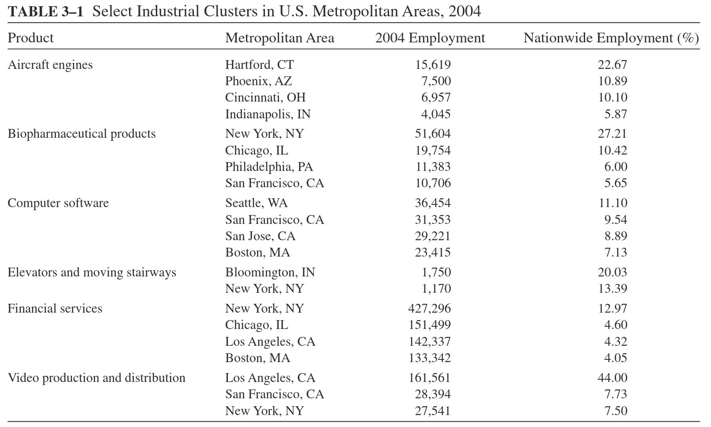
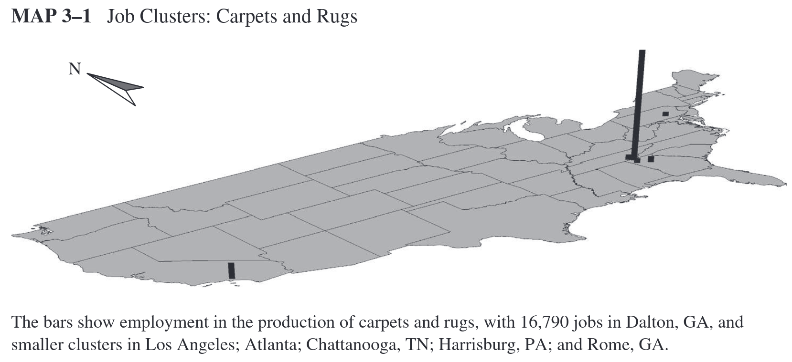
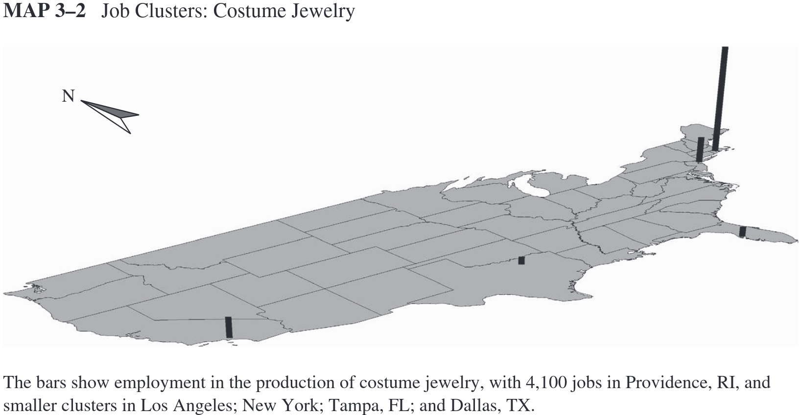

class: inverse, middle

```{R, setup, include = F}
options(htmltools.dir.version = FALSE)
pacman::p_load(
  broom, here, tidyverse, latex2exp, ggplot2, ggthemes, viridis, extrafont,
  gridExtra, kableExtra, dplyr, magrittr, knitr, emo, ggrepel, sf, hrbrthemes
)

# Define colors
## source color script from local directory
## comment out and replace colors if user is not Andrew
source("~/Documents/scripts/colors/colors.R")
blue <- "#4c566a"
purple <- "#b48ead"
red <- "#bf616a"
# XaringanExtra functions
## Tile view
xaringanExtra::use_tile_view()
## Scribble
xaringanExtra::use_scribble()
# Knitr options
opts_chunk$set(
  comment = "#>",
  fig.align = "center",
  fig.height = 7,
  fig.width = 10.5,
  warning = F,
  message = F
)
options(device = function(file, width, height) {
  svg(tempfile(), width = width, height = height)
})


```

# Contents

.hi-white[(i). Clustering]

.hi-white[(ii). City size]

.hi-white[(iii). Introduction to growth]

---
# Housekeeping

.hi[PS01 due on Sun, Oct 16th @ 11:59p]
- We will be going over material for questions 4 & 5 today
- Must be submitted on Canvas as a PDF

--

<br>

.hi[Reading]
- Finish chapter 3 by end of this week


---
# Last time: _Why do cities exist?_

We discussed some .hi[fundamentals] that lead existence, the .hi-blue[main takeaway:]

.center[.hi[Incentives] must exist to justify higher land prices within a city]

--

Two .hi[incentives:]
- benefits of .hi-blue[centralized exchange] (trading cities)
- benefits of .hi-green[centralized production] (factory cities)

  
--

<br>

.hi-blue[Other questions:]

 .center[.h[Why do cities grow beyond one factory?]]
 .center[.hi[Why are there differences in size across cities?]]
 .center[.hii[Where do cities emerge?]]

  
---
class: inverse, middle
# _Why do firms cluster?_

---
# _Why do firms cluster?_

Can we explain why there might be .hii[more than] one firm?
- Which of the .h[5 axioms] is relevant to the number of firms within a city?

--

.center[.hi[A5: _Competition generates zero economic profit_]]

<br>

--

Suppose a firm makes a .hi-blue[positive] economic profit.
- then additional firms enter the market
- $\Pi \rightarrow 0$

--

Suppose a firm makes a .hi-red[negative] economic profit
- then firms exit
- $\Pi \rightarrow 0$


---
name: zero_profit
# Clustering example

How many firms are in the cluster?

```{R, cluster_graph, echo = F, fig.height = 5, fig.width = 8, dev = "svg"}
profit <- function(x) -x^3 + 5 * x^2

# create cluster plot
ggplot(data.frame(x = c(0, 6)), aes(x)) +
  stat_function(fun = profit, col = purple, size = 1.5) +
  geom_vline(xintercept = 0, size = 0.5) +
  geom_hline(yintercept = 0, size = 0.5) +
  theme_ipsum(base_family = "Fira Sans Book", base_size = 8) +
  xlim(0, 6) +
  ylim(-20, 20) +
  labs(x = "Number of Firms\nIn Cluster", y = "Profit Per Firm")
```

---
class: inverse, middle 
# Data

---
# Data



---
name: cluster
# Data



---
name: cluster
# Data



--

Which axiom do these data relate to?

--

.hi[A2: Self-reinforcing effects generate extreme outcomes]

---
name: cluster
# _Why do firms cluster?_

Why do .hi[within-industry] firms locate in same city?

--

Why might profits .hi-blue[increase] as more firms cluster?

<br>

--

There exists some economic mechanisms that incentives .hi[within-industry] firms locate near one another
- We categorize these mechanisms broadly as .hi[agglomeration economies]

---
# Agglomeration

.hi[Definition: Agglomeration Economies]

--

_Benefits that come when firms and people locate near one another together in cities and industrial clusters_

--

> Agglomeration economies are the benefits that come when firms and people locate near one another together in cities and industrial clusters. These benefits all ultimately come from transport costs savings: the only real difference between a nearby firm and one across the continent is that it is easier to connect with a neighbor. Of course, transportation costs must be interpreted broadly, and they include the difficulties in exchanging goods, people, and ideas

Source: [Ed. Glaeser](https://www.nber.org/chapters/c7977.pdf)


---
class: inverse, middle
# Benefits of agglomeration 

- .hi-white[(i) Sharing intermediate inputs]
- .hi-white[(ii) Labor matching]
- .hi-white[(iii) Knowledge spillovers]

---
# Agglomeration - Sharing inputs

Similar firms .hi[share inputs] to benefit from economies of scale

--

Firms will share intermediate input suppliers to help .hi-red[reduce costs]
- If costs .hi-red[go down], then $\Pi$ goes .hi-blue[up]

--

.hi[Example:] High tech firms
- Rapidly changing goods that require sophisticated intermediate inputs
- Electronic components and testing facilities
- Firms rent capital/labor from intermediate firms

--

<br>

There exists an .hi[optimal cluster size] that maximizes input sharing benefits

---
# Example - Sharing inputs


---
# Agglomeration - Labor matching

In models of labor markets, we typically assume that firms and workers match perfectly

--

In the real world this is rarely the case
- Firms and workers are .blue[not always perfectly matched]
- Mismatches .hii[require training] to eliminate skill gap. .hi[Training is costly]
- Think of the training you may need for your first job

--

A large city will reduce these costs

---
# Agglomeration - Labor matching

Consider a labor pool of software programmers

--

The skill sets of these programmers vary greatly
  - Coding languages: C, Javascript, Python, Rust, etc.
  - Programming tasks: graphics, AI/ML, OS development etc.

--

Clustering .hi[attracts] more of the kind of workers they want

--

Better for firm if they can find a worker to fill role immediately
- Firms have higher probability in a cluster


---
# Agglomeration - Knowledge spillovers

.hi[Knowledge spillovers:] Exchange of ideas across individuals within a space

--

  - One of most important external benefit of a college campus (classroom) is the .hii[peer effects]
  
--

.hi[Examples:]
.pull-left[
- Graduate school
- Jam sessions
]
.pull-right[
- Attending seminars, workshops, and conferences
]

--

Knowledge spillovers increase with more people and more knowledge

--

$\Rightarrow$ Knowledge Spillovers $\uparrow$ $\longrightarrow$ Productivity $\uparrow$

--

.hi-blue[Urban settings:] Silicon Valley, Wall Street, etc.

---
name: urban
# Types of agglomeration

Distinctions between two types of agglomeration

--

.hi[(i) _Localization economies_]

- Economic forces that incentivise clustering of firms .hi[within-industry]
- Local to a particular industry
- Examples: Silicon Valley; biopharmaceuticals 

--
  
.hii[(ii) _Urbanization economies_]

- Economic forces that cause clustering of firms .hii[across-industry]
- The presence of one firm attracts firms from different industries
- Examples: Universities; corporate headquarters
  
---

# Localization

_.hi[Localization economy:]_ occurs when an increase in the size of an industry leads to an increase in productivity of production

--

Evidence of higher .hi[labor productivity]
- Higher output $\rightarrow$ more productive workers (Henderson, 1986)
- Tech workers benefit more from .hi[knowledge spillovers] than manufacturing (Mun & Huchinson, 1995)

--

Evidence of higher .hi[rates of entry]
- More firms are born where .hii[output is higher]; that is, where the industry is clustered (Carlton, 1986)

---
# Urbanization

_.hi[Urbanization economy:]_ occurs when .hii[growth] in population increases in productivity within the economy

--

.hi[Sharing inputs:] banks, accountants, hotels, transportation

--

.hi[Pooling:] workers move .hii[across-industry] 
- low demand to high demand

--
  
.hi[Matching]: common skills across sectors (excel, for example)

--

<br>

Result in .hi[large and diverse] cities


---
# Examples

Two major examples of .hi[localization] & .hii[urbanization] economies:

<br>

.hi[(i) Silicon Valley]
- firms locate close to share .hi-blue[high-skilled labor pool] despite high rents

--


.hii[(ii) Los Angeles]
- no super dominant industries
- large, diverse, and growing workforce

---
class: inverse, middle
# City Size

---
# City Size

Why are some cities big while others are small?
- We've shown why .hi[agglomeration] explain .hii[firms] clustering.
- How does .hi[agglomeration] explain why .hii[people] cluster?

--

<br>

.hi[Agglomeration] increases productivity among its .hii[firms] and .hii[people]
- leads to higher .hi[wages] in larger cities
- higher wages incentivises migration decisions

--

<br>

Let's look at some .hi[data] of city populations in the US

---
# City Size in the US

```{R, zipf_one, echo = F, fig.height = 5, fig.width = 9, dev = "svg"}
# population data
zipf_data <- read_csv("./PEP_2018_PEPANNRSIP.US12A/PEP_2018_PEPANNRSIP.US12A_with_ann.csv") %>%
  janitor::clean_names() %>%
  mutate(
    gc_rank_rank_label = as.numeric(gc_rank_rank_label),
    respop72018 = as.numeric(respop72018),
    respop72017 = as.numeric(respop72017),
    log_c = 17.34119,
    zipf_pop = log_c - log(gc_rank_rank_label)
  )


# graph
ggplot(zipf_data) +
  geom_point(
    aes(x = gc_rank_rank_label, y = respop72018),
    col = blue
  ) +
  theme_ipsum(base_family = "Fira Sans Book", base_size = 8) +
  labs(x = "Rank", y = "Popluation"
       # , title = "City Size in the US"
       ) +
  scale_y_continuous(labels = scales::comma)
```

--

A functional relationship exists between population and rank within a country

---
# What Function? f(x) = 1/x

```{R, zipf_two, echo = F, fig.height = 5, fig.width = 9, dev = "svg"}
inverse <- function(x) 1 / x

ggplot(data.frame(x = c(0, 1000)), aes(x)) +
  stat_function(fun = inverse, col = blue, size = 1.5) +
  geom_vline(xintercept = 0, size = 0.5) +
  geom_hline(yintercept = 0, size = 0.5) +
  ylim(0, .05) +
  theme_ipsum(base_family = "Fira Sans Book", base_size = 8) +
  geom_text(x = 250, y = .01, label = latex2exp::TeX("function: $f(x) = \\frac{1}{x}$")) +
  labs(x = "x", y = "\nf(x)\n")
```

---
# What Function? Zipf's law

```{R, zipf_three, echo = F, fig.height = 5, fig.width = 9, dev = "svg"}
inverse_2 <- function(x) 1000000 / x

ggplot(data.frame(x = c(0, 1000)), aes(x)) +
  stat_function(fun = inverse_2, col = blue, size = 1.5) +
  geom_vline(xintercept = 0, size = 0.5) +
  geom_hline(yintercept = 0, size = 0.5) +
  ylim(0, 80000) +
  theme_ipsum(base_family = "Fira Sans Book", base_size = 8) +
  geom_text(x = 250, y = 10000, label = latex2exp::TeX("function: $f(x) = \\frac{1000000}{x}$")) +
  labs(x = "x", y = "\nf(x)\n")
```

---
name: zipf
# Size: Zipf's Law

_Zipf's law_ of city size can be expressed as:

\begin{align*}
R = \frac{C}{N}
\end{align*}

.hi[Where:]
- R represents a country's population rank
- C represents a constant for a country/region
- N represents the population level

--

We can use this function to approximate city size based on rank

---
# Zipf's Law: Example

Assume the .hi[third] largest city in a region has .hii[200,000 people] ( $N$ )

- Use _Zipf's law_ to estimate the population in the .hi[fifth-largest] city


.hi[Two steps:]

--

.hi[(i)] Calculate the constant $C$:

\begin{align*}
3 &= \frac{C}{200,000}\\
C &=  600,000
\end{align*}

--

.hi[(ii)] Use that info to calculate the population of the .hi[fifth-largest] city:

\begin{align*}
5 &= \frac{600,000}{Pop_5}
\end{align*}


---
count: false
# Zipf's Law: Example

Assume the .hi[third] largest city in a region has .hii[200,000 people] ( $N$ )

- Use _Zipf's law_ to estimate the population in the .hi[fifth-largest] city


.hi[Two steps:]

.hi[(i)] Calculate the constant $C$:

\begin{align*}
3 &= \frac{C}{200,000}\\
C &=  600,000
\end{align*}

.hi[(ii)] Use that info to calculate the population of the .hi[fifth-largest] city:

\begin{align*}
5 &= \frac{600,000}{Pop_5} \implies Pop_5 = 120,000
\end{align*}

---
# Zipf's Law: Intuition

What does _Zipf's law_ describe about the relationship between .hi[rank] and .hi[city size]?

--

<br>

- a few cities will be big
- there is a .hi[big drop] in population as rank increases
- most low rank (high number) cities are .hi[pretty similar] in size

---
# Example: Zipf's Law

.hi[(i).] Assume that the Zipf's Law for cities is exactly true. If the .hi[fourth-largest] city in a region has .hii[2.5 million] people, how many people live in the region's .hi[largest] city? Show your work.

<br>

.hi[(ii).] How many people live in the region's .hi[tenth-largest] city? Show your work.

---
# Primate Cities

--

.hi-blue[Definition]: A .hi[primate city] is


> A major city that works as the .hi[financial, political, and population center of a country] and is not rivaled in any of these aspects by any other city in that country.

> "_at least twice as large as the next largest city and more than twice as significant."_

--

.hi[Examples]:
.smallerer[
.pull-left[
.hi[City]
- Seoul, South Korea
- Santiago, Chile 
- Buenos Aires, Argentina
- Lima, Peru
]
]
.smallerer[
.pull-right[
.hi[Percent of Total Population]
- 45.8%
- 35.5%
- 33.7%
- 31.7%
]
]


---
# Primate Cities

What might generate primate cities?
- Large .hi[economies of scale] in exchange
- Inadequate .hii[transportation infrastructure] elsewhere

--

.hi[Political factors:]
- Easier for dictators to bribe, surveil populations of a primary city?
-  Capital cities with dictatorships are _45%_ larger than capital cities of other countries
- Is this relationship .hi-blue[causal]? <sup>.hii[†]</sup>

--

.footnote[
.hii[†] Maybe somebody does. But you definitely can't say from the 45% number. Much of modern econ is about figuring out when relationships _are_ causal. For a completely unrelated, but informative and entertaining example, see [this video](https://www.youtube.com/watch?v=6YrIDhaUQOE&t=133s). 
]

---
# Zipf's Law

Why is _Zipf's Law_ generally accurate in describing city size?

--

.hi[A2:] _.hi[Self-reinforcing effects] generate extreme outcomes_

"Winner take all" situations
- policies, agglomeration, knowledge spillovers, etc.
- Wages grow, workers in, firms enter, $\rightarrow$ labor demand $\uparrow$ $\rightarrow$ wages grow
  
--

What slows this process down?

--

Increases in costs lead to .hi[diseconomies of scale]

---
# Size

Why do costs increase as workers move in? (Diseconomies of scale?)

.h[(i)] .hi[Commute costs]
  - More people $\implies$ more congestion (all else equal)
  
--

.h[(ii)] .hi.green[Pollution]
- More workers $\implies$ more production $\implies$ more .hi-green[pollution]

--

.h[(iii)] .hii[Disease]
- Early 1900's (US), living in a city $\rightarrow$ life expectancy $\downarrow$ 5 years
- Now, the US's largest cities life expectancy exceeds the national average
- Life expectancy in cities is, typically, lower than rural areas

---
name: utility
# Review: Utility

Use it to .hi[model] the value individuals place on different city attributes

.hi[Utility] is an abstract notion of peoples preferences

--

.hi[Assumptions:]

- .hi[(i)] Higher levels of utility are .hii[preferred] to lower levels. And more consumption is better than less
- .hi[(ii)] .hi[_Ordinal, not cardinal._] Only the .hii[rank] matters, not the .hii[level]
- .hi[(iii)] Marginal utility is diminishing (marginal value is diminishing)

--

Similar to business' maximizing profits, individuals maximize utility

---
# Modeling City Size

```{R, u_f1, echo = F, dev = "svg"}
u_f <- function(x) -x^3 + 1000 * x^2 + 100 * x
ggplot(data.frame(x = c(-10, 900)), aes(x)) +
  stat_function(fun = u_f, col = blue) +
  labs(x = "Workers (hundreds of thousands)", y = "Individual utility", title = "Individual Utility and City Size") +
  theme_ipsum(base_family = "Fira Sans Book", base_size = 8) +
  geom_vline(xintercept = 0, size = 0.5) +
  geom_hline(yintercept = 0, size = 0.5) +
  geom_segment(x = 775, xend = 775, y = 0, yend = u_f(775), linetype = "dashed") +
  geom_segment(x = 0, xend = 775, y = u_f(775), yend = u_f(775), linetype = "dashed") +
  theme(
    axis.text.y = element_blank(),
    axis.ticks.y = element_blank(),
    plot.title = element_text(hjust = 0.5)
  ) +
  geom_text(x = 0, y = u_f(775), label = "u'", hjust = 2) +
  geom_text(x = 775, y = 0, label = "775", vjust = 2)
```

---
count: false
# Modeling City Size

```{R, u_f2, echo = F, dev = "svg"}
u_f <- function(x) -x^3 + 1000 * x^2 + 100 * x
ggplot(data.frame(x = c(-10, 900)), aes(x)) +
  stat_function(fun = u_f, col = blue) +
  labs(x = "Workers (hundreds of thousands)", y = "Individual utility", title = "Individual Utility and City Size") +
  theme_ipsum(base_family = "Fira Sans Book", base_size = 8) +
  geom_vline(xintercept = 0, size = 0.5) +
  geom_hline(yintercept = 0, size = 0.5) +
  geom_segment(x = 775, xend = 775, y = 0, yend = u_f(775), linetype = "dashed") +
  geom_segment(x = 0, xend = 775, y = u_f(775), yend = u_f(775), linetype = "dashed") +
  geom_segment(x = 375, xend = 375, y = 0, yend = u_f(375), linetype = "dashed") +
  geom_segment(x = 0, xend = 375, y = u_f(375), yend = u_f(375), linetype = "dashed") +
  theme(
    axis.text.y = element_blank(),
    axis.ticks.y = element_blank(),
    plot.title = element_text(hjust = 0.5)
  ) +
  geom_text(x = 0, y = u_f(375), label = "u''", hjust = 2) +
  geom_text(x = 375, y = 0, label = "375", vjust = 2) +
  geom_text(x = 0, y = u_f(775), label = "u'", hjust = 2) +
  geom_text(x = 775, y = 0, label = "775", vjust = 2)
```

---


# Modeling City Size


```{R, u_f3, echo = F, dev = "svg"}
u_f <- function(x) -x^3 + 1000 * x^2 + 100 * x
ggplot(data.frame(x = c(-10, 900)), aes(x)) +
  stat_function(fun = u_f, col = blue) +
  labs(x = "Workers (hundreds of thousands)", y = "Individual utility", title = "Individual Utility and City Size") +
  theme_ipsum(base_family = "Fira Sans Book", base_size = 8) +
  geom_vline(xintercept = 0, size = 0.5) +
  geom_hline(yintercept = 0, size = 0.5) +
  geom_segment(x = 775, xend = 775, y = 0, yend = u_f(775), linetype = "dashed") +
  geom_segment(x = 0, xend = 775, y = u_f(775), yend = u_f(775), linetype = "dashed") +
  geom_segment(x = 1000 / 3 + (10 * (9997)^(.5)) / 3, xend = 1000 / 3 + (10 * (9997)^(.5)) / 3, y = 0, yend = u_f(1000 / 3 + (10 * (9997)^.5) / 3), linetype = "dashed") +
  geom_segment(x = 0, xend = 1000 / 3 + (10 * (9997)^(.5)) / 3, y = u_f(1000 / 3 + (10 * (9997)^.5) / 3), yend = u_f(1000 / 3 + (10 * (9997)^.5) / 3), linetype = "dashed") +
  geom_segment(x = 375, xend = 375, y = 0, yend = u_f(375), linetype = "dashed") +
  geom_segment(x = 0, xend = 375, y = u_f(375), yend = u_f(375), linetype = "dashed") +
  theme(
    axis.text.y = element_blank(),
    axis.ticks.y = element_blank(),
    plot.title = element_text(hjust = 0.5)
  ) +
  geom_text(x = 0, y = u_f(375), label = "u''", hjust = 2) +
  geom_text(x = 375, y = 0, label = "375", vjust = 2) +
  geom_text(x = 0, y = u_f(775), label = "u'", hjust = 2) +
  geom_text(x = 775, y = 0, label = "775", vjust = 2) +
  geom_text(x = 0, y = u_f(1000 / 3 + (10 * (9997)^.5) / 3), label = "u*", hjust = 2) +
  geom_text(x = 1000 / 3 + (10 * (9997)^.5) / 3, y = 0, label = "667", vjust = 2)
```

---
name: eq
# Locational Equilibrium

.hi[Locational Equilibrium] occurs when utility levels (valuations) across cities are the same for all workers

--

In a system of cities, .hi[migration] has a .hii[self-correcting] effect

Locational Eq is stable when the utility curve is downward sloping
- which implies cities tend to be too large rather than too small

--

We usually do this by .hii[worker type] (demographic, income, education, etc)
- For now, we will just consider the case when .hi[all workers are equivalent]

---
# Locational Eq Graph

```{R, u_loc, echo = F, dev = "svg"}


u_f <- function(x) -x^3 + 1000 * x^2 + 100 * x + 5000000
u_f2 <- function(x) -x^3 + 890 * x^2 + 200 * x + 7000000 + .0002 * x^4
u_f3 <- function(x) -x^3 + 900 * x^2 + 400 * x + 20000000 + .0002 * x^4

ggplot(data.frame(x = c(-10, 1000)), aes(x)) +
  stat_function(fun = u_f, col = blue) +
  stat_function(fun = u_f2, col = purple) +
  stat_function(fun = u_f3, col = red) +
  labs(x = "Workers (hundreds of thousands)", y = "Individual utility", title = "Three Cities") +
  theme_ipsum(base_family = "Fira Sans Book", base_size = 8) +
  geom_vline(xintercept = 0, size = 0.5) +
  geom_hline(yintercept = 0, size = 0.5) +
  theme(
    axis.text.y = element_blank(),
    axis.ticks.y = element_blank(),
    plot.title = element_text(hjust = 0.5)
  ) +
  geom_segment(x = 800, xend = 800, y = 0, yend = u_f(800), linetype = "dashed") +
  geom_segment(x = 886, xend = 886, y = 0, yend = u_f(800), linetype = "dashed") +
  geom_segment(x = 965, xend = 965, y = 0, yend = u_f(800), linetype = "dashed") +
  geom_segment(x = 0, xend = 965, y = u_f(800), yend = u_f(800), linetype = "dashed") +
  geom_text(x = 0, y = u_f(800), label = "u*", hjust = 2) +
  geom_text(x = 800, y = u_f(800), label = "s", hjust = -1, vjust = -1) +
  geom_text(x = 886, y = u_f(800), label = "m", hjust = -1, vjust = -1) +
  geom_text(x = 965, y = u_f(800), label = "b", hjust = -1, vjust = -1)
```


---

# Locational Eq: Implications

_Why is this framework useful?_
- If utility really has this shape, what does this mean for policy?
  
--

_Policies that impact the .hi[spatial distribution] of the population can have far flung effects on individuals it was not designed to impact, .hii[via migration]_

--

.hi-blue[Example:]
- Local school quality improvements $\rightarrow$ increased prices. Higher utility from school quality, lower from higher prices. Some people may be displaced? (Gentrification)
  
--

- Net effect could be positive, but there will be winners and losers
    
--

More on this later in the term when we study _.hii[place-based] policies_

---
class: inverse, middle
# Growth

---
name:growth_factors
# Growth

.hii[Econ in General]: Defined as an increase in per-capita income

.hi[Urban Economics]: Defined as an increase .hi[_utility level_] of a typical resident

--

Urban definition accounts for factors .hi[other than wage.] Such as:
  
--

.hi[(i).] Increases in natural resources (.blue[gold is found under a city])

--

.hi[(ii).] Increases in physical capital (.blue[computers] `r emo::ji("computer")`)

--

.hi[(iii).] Increases in human capital (.blue[education] `r emo::ji("mortar_board")`)

--

.hi[(iv).] Technological progress (.blue[computers invented])

--

.hi[(v).] Agglomeration Economies `r emo::ji("cityscape")`


---
name:example
# Example: Innovation

.pull-left[
```{R, u_innov, echo = F, dev = "svg"}
u_f <- function(x) -x^3 + 1000 * x^2 + 100 * x + 50000000
u_f4 <- function(x) -x^3 + 1040 * x^2 + 1130 * x + 90000000

ggplot(data.frame(x = c(-10, 1000)), aes(x)) +
  stat_function(fun = u_f, col = blue) +
  labs(x = "Workers (hundreds of thousands)", y = "Individual utility", title = "Individual Utility and City Size") +
  theme_ipsum(base_family = "Fira Sans Book", base_size = 8) +
  geom_vline(xintercept = 0, size = 0.5) +
  geom_hline(yintercept = 0, size = 0.5) +
  theme(
    axis.text.y = element_blank(),
    axis.ticks.y = element_blank(),
    plot.title = element_text(hjust = 0.5)
  ) +
  geom_segment(x = 800, xend = 800, y = 0, yend = u_f(800), linetype = "dashed") +
  geom_segment(x = 0, xend = 800, y = u_f(800), yend = u_f(800), linetype = "dashed") +
  geom_text(x = 800, y = 0, label = "800", vjust = 2) +
  geom_text(x = 0, y = u_f(800), label = "u'", hjust = 2)
```
]

.pull-right[
Initially: 2 cities, both with same utility curve

Population each city: .orange[800k] (total pop, 1.6 m)]

---
# Example: Innovation

.pull-left[
```{R, u_innov2, echo = F, dev = "svg"}
u_f <- function(x) -x^3 + 1000 * x^2 + 100 * x + 50000000
u_f4 <- function(x) -x^3 + 1040 * x^2 + 1130 * x + 90000000


ggplot(data.frame(x = c(-10, 1000)), aes(x)) +
  stat_function(fun = u_f, col = blue) +
  stat_function(fun = u_f4, col = purple) +
  labs(x = "Workers (hundreds of thousands)", y = "Individual utility", title = "Individual Utility and City Size") +
  theme_ipsum(base_family = "Fira Sans Book", base_size = 8) +
  geom_vline(xintercept = 0, size = 0.5) +
  geom_hline(yintercept = 0, size = 0.5) +
  theme(
    axis.text.y = element_blank(),
    axis.ticks.y = element_blank(),
    plot.title = element_text(hjust = 0.5)
  ) +
  geom_segment(x = 800, xend = 800, y = 0, yend = u_f(800), linetype = "dashed") +
  geom_segment(x = 0, xend = 800, y = u_f(800), yend = u_f(800), linetype = "dashed") +
  geom_text(x = 800, y = 0, label = "800", vjust = 2) +
  geom_text(x = 0, y = u_f(800), label = "u'", hjust = 2) +
  geom_segment(x = 800, xend = 800, y = 0, yend = u_f4(800), linetype = "dashed") +
  geom_segment(x = 0, xend = 800, y = u_f4(800), yend = u_f4(800), linetype = "dashed") +
  geom_text(x = 0, y = u_f4(800), label = "u''", hjust = 2)
```
]


.pull-right[
Productivity shock brings one city's curve up (due to say, higher wages)

In the absence of migration, utility is now higher in the higher productivity city]

---
# Example: Innovation

.pull-left[
```{R, u_innov3, echo = F, dev = "svg"}
u_f <- function(x) -x^3 + 1000 * x^2 + 100 * x + 50000000
u_f4 <- function(x) -x^3 + 1000 * x^2 + 100 * x + 90000000

ggplot(data.frame(x = c(-10, 1000)), aes(x)) +
  stat_function(fun = u_f, col = blue) +
  stat_function(fun = u_f4, col = purple) +
  labs(x = "Workers (hundreds of thousands)", y = "Individual utility", title = "Individual Utility and City Size") +
  theme_ipsum(base_family = "Fira Sans Book", base_size = 8) +
  geom_vline(xintercept = 0, size = 0.5) +
  geom_hline(yintercept = 0, size = 0.5) +
  theme(
    axis.text.y = element_blank(),
    axis.ticks.y = element_blank(),
    plot.title = element_text(hjust = 0.5)
  ) +
  geom_segment(x = 800, xend = 800, y = 0, yend = u_f(800), linetype = "dashed", alpha = .3) +
  geom_segment(x = 0, xend = 800, y = u_f(800), yend = u_f(800), linetype = "dashed", alpha = .3) +
  geom_text(x = 800, y = 0, label = "800", vjust = 2) +
  geom_text(x = 0, y = u_f(800), label = "u'", hjust = 2) +
  geom_segment(x = 800, xend = 800, y = 0, yend = u_f4(800), linetype = "dashed", alpha = .3) +
  geom_segment(x = 0, xend = 800, y = u_f4(800), yend = u_f4(800), linetype = "dashed", alpha = .3) +
  geom_text(x = 0, y = u_f4(800), label = "u''", hjust = 2) +
  geom_segment(x = 0, xend = 738.22, y = u_f(738.22), yend = u_f(738.22), linetype = "dashed") +
  geom_segment(x = 0, xend = 861.8, y = u_f4(861.8), yend = u_f4(861.8), linetype = "dashed") +
  geom_segment(x = 738.22, xend = 738.22, y = 0, yend = u_f(738.22), linetype = "dashed") +
  geom_segment(x = 861.8, xend = 861.8, y = 0, yend = u_f4(861.8), linetype = "dashed") +
  geom_text(x = 0, y = u_f(738.22), label = "u*", hjust = 1.5) +
  geom_text(x = 738.22, y = 0, label = "738", vjust = 2) +
  geom_text(x = 861.8, y = 0, label = "862", vjust = 2)
```

]
.pull-right[
.hi[Migration] induces workers toward the more productive city and away from the less productive city

- .hii[New locational eq] ( $u^*$ ): utility is equalized (higher than before). populations change 
]


--

.hi-blue[Note]: We are implicitly assuming

- People are identical and perfectly mobile

In real life high-skilled workers are far more mobile than low skilled

---
# Example Recap

<div style="text-align: left"> Consider two cities: each with an equilibrium population of 800k and the same utility per worker curve</div>

- .hi[Innovation] (tech progress) in one city .blue[shifts utility per worker] curve up

--

- Workers in the innovative city enjoy a higher level of utility

- Workers migrate from the city that failed to innovate

--

Eventually, a new equilibrium is reached where .hi[utility per worker] is the .hi[same across both cities]
  
- Innovative city is larger

---
name:economy_wide
# Economy - Wide Growth

.hi[Note]: If there is an .hii[innovation for the entire economy], then .hi[both cities] experience upward shift of utility curve
  
  - Since there is no utility gap, there is .hi[no migration]

--

  - Still economic growth, but city sizes stay the same

---
# Table of Contents

.pull-left[
### Clustering
.smallest[
1. [Reasons for Firm Clustering](#cluster)

1. [Urbanizations vs Localization](#urban)
]


### City Size
.smallest[

1. [Zipf's Law](#zipf)

1. [Utility](#utility)

1. [Locational Eq](#eq)
]
]

.pull-right[
## Growth
.smallest[

1. [Growth factors](#growth_factors)

1. [Example](#example)

1. [Economy Wide Growth](#economy_wide)

]
]


---

exclude:true


<!-- --- -->
<!-- exclude: true -->

<!-- ```{R, generate pdfs, include = F} -->
<!-- system("decktape remark 02_goodsmarket_part1.html 02_goodsmarket_part1.pdf --chrome-arg=--allow-file-access-from-files") -->
<!-- ``` -->


