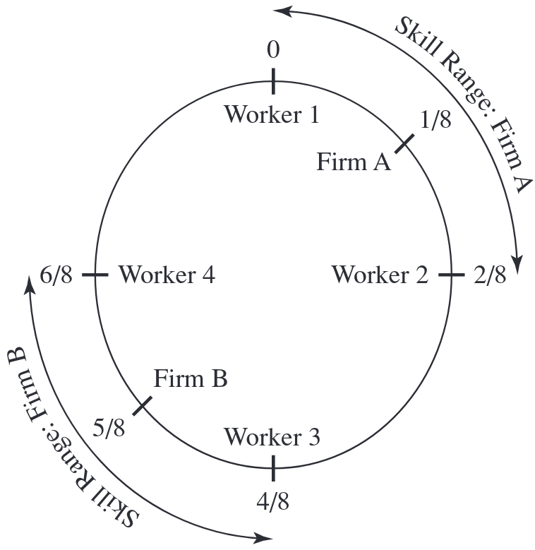
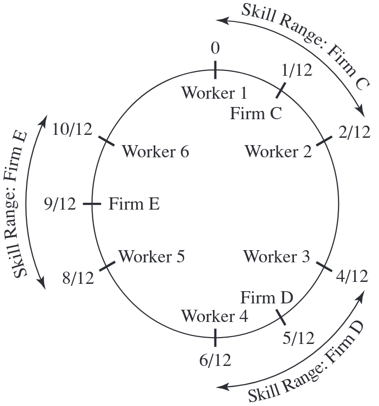
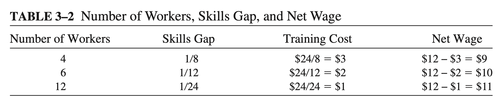

class: inverse, middle

```{R, setup, include = F}
options(htmltools.dir.version = FALSE)
pacman::p_load(
  broom, here, tidyverse, latex2exp, ggplot2, ggthemes, viridis, extrafont,
  gridExtra, kableExtra, dplyr, magrittr, knitr, emo, ggrepel, sf, hrbrthemes
)

# Define colors
## source color script from local directory
## comment out and replace colors if user is not Andrew
source("~/Documents/scripts/colors/colors.R")
blue <- "#4c566a"
purple <- "#b48ead"
red <- "#bf616a"
# XaringanExtra functions
## Tile view
xaringanExtra::use_tile_view()
## Scribble
xaringanExtra::use_scribble()
# Knitr options
opts_chunk$set(
  comment = "#>",
  fig.align = "center",
  fig.height = 7,
  fig.width = 10.5,
  warning = F,
  message = F
)
options(device = function(file, width, height) {
  svg(tempfile(), width = width, height = height)
})


```

# Contents

.hi-white[(i). Clustering]

.hi-white[(ii). City size]

.hi-white[(iii). Introduction to growth]

---
# Housekeeping

.hi[PS01 due on Wed, Oct 12th @ 11:59p]
- We will be going over material for questions 4 & 5 today
- Must be submitted on Canvas as a PDF

--

<br>

.hi[Reading]
- Finish chapter 3 by end of this week


---
# Last time: _Why do cities exist?_

We discussed some .hi[fundamentals] that lead existence, the .hi-blue[main takeaway:]

.center[.hi[Incentives] must exist to justify higher land prices within a city]

--

Two .hi[incentives:]
- benefits of .hi-blue[centralized exchange] (trading cities)
- benefits of .hi-green[centralized production] (factory cities)

  
--

.hi-blue[Other questions:]
 .center[.h[Why do cities grow beyond one factory?]]
 .center[.hi[Why are there differences in size across cities?]]
 .center[.hii[Where do cities emerge?]]

  
---
class: inverse, middle
# Firm clustering

---
# Clustering

Can we explain why there might be .hii[more than] one firm?
- Which of the .h[5 axioms] is relevant to the number of firms within a city?

--

.center[.hi[A5: _Competition generates zero economic profit_]]

<br>

--

Suppose a firm makes a .hi-blue[positive] economic profit.
- then additional firms enter the market
- $\Pi \rightarrow 0$

--

Suppose a firm makes a .hi-red[negative] economic profit
- then firms exit
- $\Pi \rightarrow 0$


---
name: zero_profit
# Clustering example

How many firms are in the cluster?

```{R, cluster_graph, echo = F, fig.height = 5, fig.width = 8, dev = "svg"}
profit <- function(x) -x^3 + 5 * x^2

# create cluster plot
ggplot(data.frame(x = c(0, 6)), aes(x)) +
  stat_function(fun = profit, col = purple, size = 1.5) +
  geom_vline(xintercept = 0, size = 0.5) +
  geom_hline(yintercept = 0, size = 0.5) +
  theme_ipsum(base_family = "Fira Sans Book", base_size = 8) +
  xlim(0, 6) +
  ylim(-20, 20) +
  labs(x = "Number of Firms\nIn Cluster", y = "Profit Per Firm")
```

---
class: inverse, middle 
# Data

---
# Data


---
name: cluster
# Data


---
name: cluster
# Data


--

Which axiom do these data relate to?

--

.hi[A2: Self-reinforcing effects generate extreme outcomes]

---
name: cluster
# Data

But wouldn't firm entry .hi-red[reduce] existing firm profits?

--

Why might profit increase ( $\Pi \uparrow$ ) initially as more firms .hi[cluster]?

<br>

--

Firms may .hi-blue[mutually benefit] from clustering due to:

--

- .hii[(i).] Sharing intermediate inputs
- .hii[(ii).] Labor matching 
- .hii[(iii).] Knowledge spillovers
- .hii[(iv).] Labor pool sharing

---
class: inverse, middle
# Clustering

---
# (i). Sharing inputs

Similar firms .hi-blue[share inputs] to benefit from economies of scale

--

.hi-blue[Example:] High tech firms
- Rapidly changing goods that require sophisticated intermediate inputs
- Electronic components and testing facilities
    
--

Firms will .hi-blue[share intermediate input suppliers] to help .hi-red[reduce costs]
- If costs .hi-red[go down], then $\Pi$ goes .hi-blue[up]

--

<br>

There exists an .hi[optimal cluster size] that maximizes input sharing benefits

---
# (ii). Labor matching

In models of labor markets, we typically assume that firms and workers match perfectly

--

In the real world this is rarely the case
- Firms and workers are .blue[not always perfectly matched]
- Mismatches .hii[require training] to eliminate skill gap. .hi[Training is costly]
- Think of the training you may need for your first job

--

A large city will reduce these costs

---
# (ii). Labor matching

Consider a labor pool of software programmers

--

The skill sets of these programmers vary greatly
  - Coding languages: C, Javascript, Python, Rust, etc.
  - Programming tasks: graphics, AI/ML, OS development etc.

--

Clustering .hi[attracts] more of the kind of workers they want

--

Better for firm if they can find a worker to fill role immediately
- Firms have higher probability in a cluster

---
# (ii). Labor matching: HS model

.hi[Model assumptions:]


.smallererer[.hi[(i). Variation in worker skills:] Workers have a unique skill set described by an "address" on a circle]

--

.smallererer[.hi[(ii). Firm entry:] Firms enter the market and pick a good with an associated skill requirement]

--

.smallererer[.hi[(iii). Training costs:] Workers incur the cost associated with closing the gap on the circle between their own skill and the skill requirement to produce the good]

--

.smallererer[.hi[(iv). Competition for workers:] Each firm offers a wage to anyone who meets the skill requirement; workers accept the highest net wage
- Net wage $=$ gross wage - training costs]

--

.smallererer[Additionally, assume]

- .smallererer[.hi[A4: Production is subject to economies of scale] to ensure firms hire more than one worker]

- .smallererer[.hi[A5: Competition generates zero economic profit] to ensure perfect competition]

---
# (ii). Labor matching: HS model

.hi[Consider two cities:] 
.pull-left[
- City A: two firms, four workers (four skill types)
]

.pull-right[
- City B: three firms, six workers (six skill types)
]

--

.pull-left[

]
  
--

.pull-right[

]

---
class: clear
count: false



Increases in the number of workers .hi-red[decreases] mismatches + training costs

--

.hi[Implications:]
- Presence of a large workforce attracts firms that compete for workers
- Higher wages incentivize high-skilled workers to live in large cities


---
# (iii). Knowledge spillovers

.hi-blue[Knowledge spillovers:] Exchange of ideas across individuals within a space

--

  - One of most important external benefit of a college campus (classroom) is the .hii[peer effects]
  
--

.hi-blue[Examples:]
.pull-left[
- Graduate school
- Jam sessions
]
.pull-right[
- Attending seminars, workshops, and conferences
]

--

Knowledge spillovers increase with more people and more knowledge

--

$\Rightarrow$ Knowledge Spillovers $\uparrow$ $\longrightarrow$ Productivity $\uparrow$

--

.hi-blue[Urban settings:] Silicon Valley, Wall Street, etc.

---

# Agglomeration economies

.ul[.hi-blue[Definition]]: .hi[Agglomeration Economies]

--

- Benefits that come when firms and people locate near one another together in cities and industrial clusters

--

> Agglomeration economies are the benefits that come when firms and people locate near one another together in cities and industrial clusters. These benefits all ultimately come from transport costs savings: the only real difference between a nearby firm and one across the continent is that it is easier to connect with a neighbor. Of course, transportation costs must be interpreted broadly, and they include the difficulties in exchanging goods, people, and ideas

Source: [Ed. Glaeser](https://www.nber.org/chapters/c7977.pdf)

---

name: urban
# Agglomeration economies

Let's refine our language with definitions:

--

.hi[(i) _Localization economies_]

- The economic forces that cause clustering that act on firms .blue[_within the same_] industry
- Local to a particular industry
- Example: Firms in the software industry cluster in Silicon Valley

--
  
.hii[(ii) _Urbanization economies_]

- The economic forces that cause clustering that act on firms .blue[_across different_] industries
- The presence of one firm attracts firms from different industries
- Example: Universities; corporate headquarters
  
---

# Localization Economies

A _.hi[localization economy]_ occurs when an increase in the size of an industry leads to an increase in productivity of production

.center[.hi[Why?]]

--

Evidence of higher .hi[labor productivity]

- Higher output $\rightarrow$ more productive workers (Henderson, 1986)
  
- Tech workers benefit more from .orange[knowledge spillovers] than manufacturing (Mun & Huchinson, 1995)

--

Evidence of higher .hi[rates of entry]

- More firms are born where .hii[output is higher]; that is, where the industry is clustered (Carlton, 1986)

---
# Urbanization Economies

_.hii[Urbanization Economies]_- the size of a city increases in productivity

.center[.hi[Why?]]

--

.hi[Sharing intermediate goods]: (banks, accountants, hotels, transportation)
  
--

.hi[Pooling]: workers move from industries with low demand to high demand
- .orange[across] sector

--
  
.hi[Matching]: common skills across sectors (excel, for example)

--

<br>

Urbanization Economies result in .hi[large, diverse cities]


---
# Examples

Two major examples of .hi[localization] & .hi.orange[urbanization] economies:

1) .hi-blue[Silicon Valley]

--

- .hi[Localization]: firms locate close to each other to share .orange[high-skilled labor pool] despite very high rents

--


2) .hi-blue[Los Angeles]

--

- .hii[Urbanization]: No super dominant industries, yet it continues to grow

---
class: inverse, middle, center
# City Size

---
# City Size

.hi[Why are some cities big while others are small?]

--

We've seen why agglomeration economies explain why .hi[firms] cluster.

--

But how to agglomeration economies explain why .hii[people] cluster?

--

- Agglomeration economies increase productivity and lead to higher wages in larger cities

--

<br>

.hi[Let's look at some data of city populations in the US]

---
# City Size in the US

```{R, zipf_one, echo = F, fig.height = 5, fig.width = 8, dev = "svg"}
# population data
zipf_data <- read_csv("./PEP_2018_PEPANNRSIP.US12A/PEP_2018_PEPANNRSIP.US12A_with_ann.csv") %>%
  janitor::clean_names() %>%
  mutate(
    gc_rank_rank_label = as.numeric(gc_rank_rank_label),
    respop72018 = as.numeric(respop72018),
    respop72017 = as.numeric(respop72017),
    log_c = 17.34119,
    zipf_pop = log_c - log(gc_rank_rank_label)
  )


# graph
ggplot(zipf_data) +
  geom_point(
    aes(x = gc_rank_rank_label, y = respop72018),
    col = "purple"
  ) +
  theme_classic(base_family = "LM Roman 10") +
  labs(x = "Rank", y = "Popluation", title = "City Size in the US") +
  scale_y_continuous(labels = scales::comma)
```

--

There seems to be a functional relationship within city sizes and rank within a single country

---
# What Function? f(x) = 1/x

```{R, zipf_two, echo = F, fig.height = 5, fig.width = 8, dev = "svg"}
inverse <- function(x) 1 / x

ggplot(data.frame(x = c(0, 1000)), aes(x)) +
  stat_function(fun = inverse, col = "purple") +
  geom_vline(xintercept = 0, size = 0.5) +
  geom_hline(yintercept = 0, size = 0.5) +
  ylim(0, .05) +
  ggthemes::theme_pander(base_family = "LM Roman 10") +
  geom_text(x = 250, y = .01, label = latex2exp::TeX("function: $f(x) = \\frac{1}{x}$")) +
  labs(x = "x", y = "\nf(x)\n")
```

---
# What Function? Zipf's law

```{R, zipf_three, echo = F, fig.height = 5, fig.width = 8, dev = "svg"}
inverse_2 <- function(x) 1000000 / x

ggplot(data.frame(x = c(0, 1000)), aes(x)) +
  stat_function(fun = inverse_2, col = "purple") +
  geom_vline(xintercept = 0, size = 0.5) +
  geom_hline(yintercept = 0, size = 0.5) +
  ylim(0, 80000) +
  ggthemes::theme_pander(base_family = "LM Roman 10") +
  geom_text(x = 250, y = 10000, label = latex2exp::TeX("function: $f(x) = \\frac{1000000}{x}$")) +
  labs(x = "x", y = "\nf(x)\n")
```

---
name: zipf
# Size: Zipf's Law

.hi[Zipf's Law] of city size can be expressed as:

\begin{align*}
rank = \frac{C}{N}
\end{align*}

.hi[Where]

- C represents a constant for a country/region

- N represents the population level

--

We can use the function described by Zipf's law to approximate city size based on rank

---
# Zipf's Law: Example

Assume the .hi[third] ( _rank_ ) largest city in a region has .hii[200,000 people] ( $N$ )

- Use Zipf's law to figure out how many people are in the _fifth-largest_ city


.hi[Two steps:]

--

1) Calculate the constant $C$:

\begin{align*}
3 &= \frac{C}{200,000}\\
C &=  600,000
\end{align*}

--

2) Use that info to calculate the population of the 5th largest city:

\begin{align*}
5 &= \frac{600,000}{Pop_5}
\end{align*}

---


# Zipf's Law: Example

Assume the .hi[third] ( _rank_ ) largest city in a region has .hii[200,000 people] ( $N$ )

- Use Zipf's law to figure out how many people are in the _fifth-largest_ city


.hi[Two steps:]

1) Calculate the constant $C$:

\begin{align*}
3 &= \frac{C}{200,000}\\
C &=  600,000
\end{align*}

2) Use that info to calculate the population of the 5th largest city:

\begin{align*}
5 &= \frac{600,000}{Pop_5} \implies Pop_5 = 120,000
\end{align*}

---


# Zipf's Law: Intuition

.qa[Q]: In words, what does .hii[Zipf's law] tell us about the relationship between .hi[rank] and .hi[city size]?

--

.qa[A1]: In words, this equation says:

  - .hi[A few] cities will be big

--

  - There is a .hi[big drop] in population as rank increases
  
  - Most low rank (high number) cities are .hi[pretty similar] in size

---
# Example: Zipf's Law

.hi[(i).] Assume that the Zipf's Law for cities is exactly true. If the .hi[fourth-largest] city in a region has .hii[2.5 million] people, how many people live in the region's .hi[largest] city? Show your work.

<br>

.hi[(ii).] How many people live in the region's .hi[tenth-largest] city? Show your work.

---
# Primate Cities

--

.hi-blue[Definition]: A .hi[primate city] is


> A major city that works as the .hi[financial, political, and population center of a country] and is not rivaled in any of these aspects by any other city in that country.

--

> "_at least twice as large as the next largest city and more than twice as significant."_

--

.hi[Examples]:
.smallerer[
.pull-left[
.hi[City]
- Seoul, South Korea
- Santiago, Chile 
- Buenos Aires, Argentina
- Lima, Peru
]
]
.smallerer[
.pull-right[
.hi[Percent of Total Population]
- 45.8%
- 35.5%
- 33.7%
- 31.7%
]
]


---

# Why Primate Cities?

What might generate primate cities?

- Large .hi[economies of scale] in exchange

- Inadequate .hii[transportation infrastructure] elsewhere

--

- .hi[Political factors]?

--

  - Easier for dictators to bribe, surveil populations of a primary city (?)
  
  -  Capital cities with dictatorships are _45%_ larger than capital cities of other countries
    
   - Is this relationship .hi.orange[causal]? <sup>.orange[†]</sup>

--

.footnote[
.orange[†] Maybe somebody does. But you definitely can't say from the 45% number. Much of modern econ is about figuring out when relationships _are_ causal. For a completely unrelated, but informative and entertaining example, see [this video](https://www.youtube.com/watch?v=6YrIDhaUQOE&t=133s). 
]

---
# Why Zipf's Law?

.qa[Q]: _Why does Zipf's Law_ do pretty well in general at describing city size?

--

.qa[A]: __Axiom 2__: _.hi[Self-reinforcing effects] generate extreme outcomes_

  - "Winner take all" situations from policies, agglomeration, knowledge spillovers, etc.

--

  - Wages grow, workers in, firms enter, $\rightarrow$ labor demand $\uparrow$ $\rightarrow$ wages grow . `r emo::ji("repeat")`
  
--

.qa[Q]: What slows this process down?

--

.center[.hi[Increases in costs lead to diseconomies of scale]]

---
# Size

Why do costs increase as workers move in? (Diseconomies of scale?)

(i). .hi[Commute costs increase]

  - More people $\implies$ more congestion (all else equal)
  
--

(ii). .hi.green[Pollution] increases

  - More workers $\implies$ more production $\implies$ more .green[pollution]?

--

(iii). .hii[Disease]

--
  - Early 1900's (US), living in a city $\rightarrow$ life expectancy $\downarrow$ 5 years
  
  - Now, the US's largest cities life expectancy exceeds the national average

--

  - Life expectancy in cities is lower than rural areas in developing economies. .hi[Why?]

---
name: utility
# Utility

.hi[Utility] is an abstract notion of peoples preferences. A few assumptions:

--

What we use to model the values individuals place on different city attributes

--

.hi[(i).] Higher levels of utility are .hii[preferred] to lower levels. And more consumption is better than less

.hi[(ii).] .hi[_Ordinal, not cardinal._] Only the .hii[rank] matters, not the .hii[level]

--

.hi[(iii).] Marginal utility is diminishing (marginal value is diminishing)

--

.center[.hi[Similar to the assumption that firms maximize profits, we also assume that individuals maximize utility]]

---
# Modeling City Size

```{R, u_f1, echo = F, dev = "svg"}
u_f <- function(x) -x^3 + 1000 * x^2 + 100 * x
ggplot(data.frame(x = c(-10, 900)), aes(x)) +
  stat_function(fun = u_f, col = "purple") +
  labs(x = "Workers (hundreds of thousands)", y = "Individual utility", title = "Individual Utility and City Size") +
  theme_minimal(base_family = "LM Roman 10") +
  geom_vline(xintercept = 0, size = 0.5) +
  geom_hline(yintercept = 0, size = 0.5) +
  geom_segment(x = 775, xend = 775, y = 0, yend = u_f(775), linetype = "dashed") +
  geom_segment(x = 0, xend = 775, y = u_f(775), yend = u_f(775), linetype = "dashed") +
  theme(
    axis.text.y = element_blank(),
    axis.ticks.y = element_blank(),
    plot.title = element_text(hjust = 0.5)
  ) +
  geom_text(x = 0, y = u_f(775), label = "u'", hjust = 2) +
  geom_text(x = 775, y = 0, label = "775", vjust = 2)
```

---


# Modeling City Size


```{R, u_f2, echo = F, dev = "svg"}
u_f <- function(x) -x^3 + 1000 * x^2 + 100 * x
ggplot(data.frame(x = c(-10, 900)), aes(x)) +
  stat_function(fun = u_f, col = "purple") +
  labs(x = "Workers (hundreds of thousands)", y = "Individual utility", title = "Individual Utility and City Size") +
  theme_minimal(base_family = "LM Roman 10") +
  geom_vline(xintercept = 0, size = 0.5) +
  geom_hline(yintercept = 0, size = 0.5) +
  geom_segment(x = 775, xend = 775, y = 0, yend = u_f(775), linetype = "dashed") +
  geom_segment(x = 0, xend = 775, y = u_f(775), yend = u_f(775), linetype = "dashed") +
  geom_segment(x = 375, xend = 375, y = 0, yend = u_f(375), linetype = "dashed") +
  geom_segment(x = 0, xend = 375, y = u_f(375), yend = u_f(375), linetype = "dashed") +
  theme(
    axis.text.y = element_blank(),
    axis.ticks.y = element_blank(),
    plot.title = element_text(hjust = 0.5)
  ) +
  geom_text(x = 0, y = u_f(375), label = "u''", hjust = 2) +
  geom_text(x = 375, y = 0, label = "375", vjust = 2) +
  geom_text(x = 0, y = u_f(775), label = "u'", hjust = 2) +
  geom_text(x = 775, y = 0, label = "775", vjust = 2)
```

---


# Modeling City Size


```{R, u_f3, echo = F, dev = "svg"}
u_f <- function(x) -x^3 + 1000 * x^2 + 100 * x
ggplot(data.frame(x = c(-10, 900)), aes(x)) +
  stat_function(fun = u_f, col = "purple") +
  labs(x = "Workers (hundreds of thousands)", y = "Individual utility", title = "Individual Utility and City Size") +
  theme_minimal(base_family = "LM Roman 10") +
  geom_vline(xintercept = 0, size = 0.5) +
  geom_hline(yintercept = 0, size = 0.5) +
  geom_segment(x = 775, xend = 775, y = 0, yend = u_f(775), linetype = "dashed") +
  geom_segment(x = 0, xend = 775, y = u_f(775), yend = u_f(775), linetype = "dashed") +
  geom_segment(x = 1000 / 3 + (10 * (9997)^(.5)) / 3, xend = 1000 / 3 + (10 * (9997)^(.5)) / 3, y = 0, yend = u_f(1000 / 3 + (10 * (9997)^.5) / 3), linetype = "dashed") +
  geom_segment(x = 0, xend = 1000 / 3 + (10 * (9997)^(.5)) / 3, y = u_f(1000 / 3 + (10 * (9997)^.5) / 3), yend = u_f(1000 / 3 + (10 * (9997)^.5) / 3), linetype = "dashed") +
  geom_segment(x = 375, xend = 375, y = 0, yend = u_f(375), linetype = "dashed") +
  geom_segment(x = 0, xend = 375, y = u_f(375), yend = u_f(375), linetype = "dashed") +
  theme(
    axis.text.y = element_blank(),
    axis.ticks.y = element_blank(),
    plot.title = element_text(hjust = 0.5)
  ) +
  geom_text(x = 0, y = u_f(375), label = "u''", hjust = 2) +
  geom_text(x = 375, y = 0, label = "375", vjust = 2) +
  geom_text(x = 0, y = u_f(775), label = "u'", hjust = 2) +
  geom_text(x = 775, y = 0, label = "775", vjust = 2) +
  geom_text(x = 0, y = u_f(1000 / 3 + (10 * (9997)^.5) / 3), label = "u*", hjust = 2) +
  geom_text(x = 1000 / 3 + (10 * (9997)^.5) / 3, y = 0, label = "667", vjust = 2)
```

---
name: eq
# Locational Equilibrium

.hi[Locational Equilibrium] occurs when utility levels (valuations) across cities are the same for all workers

--

In a system of cities, .hi[migration] has a .hii[self-correcting] effect
- Locational Eq is stable when the utility curve is downward sloping
  - $\implies$ Cities tend to be too large rather than too small

--

In practice, we usually do this by .hii[worker type] (demographic, income level, education, etc)
  
- For now, we will just consider the case when .hi[all workers are equivalent] (_but not cities_)

- This assumption is mostly for accounting purposes. Best to start simple.

---
# Locational Eq Graph

```{R, u_loc, echo = F, dev = "svg"}


u_f <- function(x) -x^3 + 1000 * x^2 + 100 * x + 5000000
u_f2 <- function(x) -x^3 + 890 * x^2 + 200 * x + 7000000 + .0002 * x^4
u_f3 <- function(x) -x^3 + 900 * x^2 + 400 * x + 20000000 + .0002 * x^4

ggplot(data.frame(x = c(-10, 1000)), aes(x)) +
  stat_function(fun = u_f, col = "purple") +
  stat_function(fun = u_f2, col = "turquoise") +
  stat_function(fun = u_f3, col = red_pink) +
  labs(x = "Workers (hundreds of thousands)", y = "Individual utility", title = "Three Cities") +
  theme_minimal(base_family = "LM Roman 10") +
  geom_vline(xintercept = 0, size = 0.5) +
  geom_hline(yintercept = 0, size = 0.5) +
  theme(
    axis.text.y = element_blank(),
    axis.ticks.y = element_blank(),
    plot.title = element_text(hjust = 0.5)
  ) +
  geom_segment(x = 800, xend = 800, y = 0, yend = u_f(800), linetype = "dashed") +
  geom_segment(x = 886, xend = 886, y = 0, yend = u_f(800), linetype = "dashed") +
  geom_segment(x = 965, xend = 965, y = 0, yend = u_f(800), linetype = "dashed") +
  geom_segment(x = 0, xend = 965, y = u_f(800), yend = u_f(800), linetype = "dashed") +
  geom_text(x = 0, y = u_f(800), label = "u*", hjust = 2) +
  geom_text(x = 800, y = u_f(800), label = "s", hjust = -1, vjust = -1) +
  geom_text(x = 886, y = u_f(800), label = "m", hjust = -1, vjust = -1) +
  geom_text(x = 965, y = u_f(800), label = "b", hjust = -1, vjust = -1)
```


---

# Locational Eq: Implications

Back to the .hi.orange[real world]: _Why is this framework useful?_

  - If utility really has this shape, what does this mean for policy?
  
--

_Policies that impact the .hi[spatial distribution] of the population can have far flung effects on individuals it was not designed to impact, .hii[via migration]_


.hi-blue[Example]:

--

- Local school quality improvements $\rightarrow$ increased prices. Higher utility from school quality, lower from higher prices. Some people may be displaced? (Gentrification)
  
--

- Net effect could be positive, but there will be winners and losers
    
--

More on this later in the term (.hii[place-based] policies). 

---


class: inverse, middle, center
# Intro to Growth

---
name:growth_factors
# Growth

.hii[Econ in General]: Defined as an increase in per-capita income

.hi[Urban Economics]: Defined as an increase .hi[_utility level_] of a typical resident

--

.hi[Urban definition accounts for factors other than wage.] Such as:
  
--

.hi[(i).] Increases in natural resources (.blue[gold is found under a city])

--

.hi[(ii).] Increases in physical capital (.blue[computers] `r emo::ji("computer")`)

--

.hi[(iii).] Increases in human capital (.blue[education] `r emo::ji("mortar_board")`)

--

.hi[(iv).] Technological progress (.blue[computers invented])

--

.hi[(v).] Agglomeration Economies `r emo::ji("cityscape")`


---
name:example
# Example: Innovation

.pull-left[
```{R, u_innov, echo = F, dev = "svg"}
u_f <- function(x) -x^3 + 1000 * x^2 + 100 * x + 50000000
u_f4 <- function(x) -x^3 + 1040 * x^2 + 1130 * x + 90000000

ggplot(data.frame(x = c(-10, 1000)), aes(x)) +
  stat_function(fun = u_f, col = "purple") +
  labs(x = "Workers (hundreds of thousands)", y = "Individual utility", title = "Individual Utility and City Size") +
  theme_minimal(base_family = "LM Roman 10") +
  geom_vline(xintercept = 0, size = 0.5) +
  geom_hline(yintercept = 0, size = 0.5) +
  theme(
    axis.text.y = element_blank(),
    axis.ticks.y = element_blank(),
    plot.title = element_text(hjust = 0.5)
  ) +
  geom_segment(x = 800, xend = 800, y = 0, yend = u_f(800), linetype = "dashed") +
  geom_segment(x = 0, xend = 800, y = u_f(800), yend = u_f(800), linetype = "dashed") +
  geom_text(x = 800, y = 0, label = "800", vjust = 2) +
  geom_text(x = 0, y = u_f(800), label = "u'", hjust = 2)
```
]

.pull-right[
Initially: 2 cities, both with same utility curve

Population each city: .orange[800k] (total pop, 1.6 m)]

---
# Example: Innovation

.pull-left[
```{R, u_innov2, echo = F, dev = "svg"}
u_f <- function(x) -x^3 + 1000 * x^2 + 100 * x + 50000000
u_f4 <- function(x) -x^3 + 1040 * x^2 + 1130 * x + 90000000


ggplot(data.frame(x = c(-10, 1000)), aes(x)) +
  stat_function(fun = u_f, col = "purple") +
  stat_function(fun = u_f4, col = red_pink) +
  labs(x = "Workers (hundreds of thousands)", y = "Individual utility", title = "Individual Utility and City Size") +
  theme_minimal(base_family = "LM Roman 10") +
  geom_vline(xintercept = 0, size = 0.5) +
  geom_hline(yintercept = 0, size = 0.5) +
  theme(
    axis.text.y = element_blank(),
    axis.ticks.y = element_blank(),
    plot.title = element_text(hjust = 0.5)
  ) +
  geom_segment(x = 800, xend = 800, y = 0, yend = u_f(800), linetype = "dashed") +
  geom_segment(x = 0, xend = 800, y = u_f(800), yend = u_f(800), linetype = "dashed") +
  geom_text(x = 800, y = 0, label = "800", vjust = 2) +
  geom_text(x = 0, y = u_f(800), label = "u'", hjust = 2) +
  geom_segment(x = 800, xend = 800, y = 0, yend = u_f4(800), linetype = "dashed") +
  geom_segment(x = 0, xend = 800, y = u_f4(800), yend = u_f4(800), linetype = "dashed") +
  geom_text(x = 0, y = u_f4(800), label = "u''", hjust = 2)
```
]


.pull-right[
Productivity shock brings one city's curve up (due to say, higher wages)

In the absence of migration, utility is now higher in the higher productivity city]

---
# Example: Innovation

.pull-left[
```{R, u_innov3, echo = F, dev = "svg"}
u_f <- function(x) -x^3 + 1000 * x^2 + 100 * x + 50000000
u_f4 <- function(x) -x^3 + 1000 * x^2 + 100 * x + 90000000

ggplot(data.frame(x = c(-10, 1000)), aes(x)) +
  stat_function(fun = u_f, col = "purple") +
  stat_function(fun = u_f4, col = red_pink) +
  labs(x = "Workers (hundreds of thousands)", y = "Individual utility", title = "Individual Utility and City Size") +
  theme_minimal(base_family = "LM Roman 10") +
  geom_vline(xintercept = 0, size = 0.5) +
  geom_hline(yintercept = 0, size = 0.5) +
  theme(
    axis.text.y = element_blank(),
    axis.ticks.y = element_blank(),
    plot.title = element_text(hjust = 0.5)
  ) +
  geom_segment(x = 800, xend = 800, y = 0, yend = u_f(800), linetype = "dashed", alpha = .3) +
  geom_segment(x = 0, xend = 800, y = u_f(800), yend = u_f(800), linetype = "dashed", alpha = .3) +
  geom_text(x = 800, y = 0, label = "800", vjust = 2) +
  geom_text(x = 0, y = u_f(800), label = "u'", hjust = 2) +
  geom_segment(x = 800, xend = 800, y = 0, yend = u_f4(800), linetype = "dashed", alpha = .3) +
  geom_segment(x = 0, xend = 800, y = u_f4(800), yend = u_f4(800), linetype = "dashed", alpha = .3) +
  geom_text(x = 0, y = u_f4(800), label = "u''", hjust = 2) +
  geom_segment(x = 0, xend = 738.22, y = u_f(738.22), yend = u_f(738.22), linetype = "dashed") +
  geom_segment(x = 0, xend = 861.8, y = u_f4(861.8), yend = u_f4(861.8), linetype = "dashed") +
  geom_segment(x = 738.22, xend = 738.22, y = 0, yend = u_f(738.22), linetype = "dashed") +
  geom_segment(x = 861.8, xend = 861.8, y = 0, yend = u_f4(861.8), linetype = "dashed") +
  geom_text(x = 0, y = u_f(738.22), label = "u*", hjust = 1.5) +
  geom_text(x = 738.22, y = 0, label = "738", vjust = 2) +
  geom_text(x = 861.8, y = 0, label = "862", vjust = 2)
```

]
.pull-right[
.hi[Migration] induces workers toward the more productive city and away from the less productive city

- .hi.orange[New locational eq] ( $u^*$ ): utility is equalized (higher than before). populations change 
]


--

.hi-blue[Note]: We are implicitly assuming

- People are identical and perfectly mobile

In real life high skilled workers are generally far more mobile than low skilled

---
# Example Recap

<div style="text-align: left"> Consider two cities: each with an equilibrium population of 800k and the same utility per worker curve</div>

- .hi[Innovation] (tech progress) in one city .blue[shifts utility per worker] curve up

--

- Workers in the innovative city enjoy a higher level of utility

- Workers migrate from the city that failed to innovate

--

Eventually, a new equilibrium is reached where .hi[utility per worker] is the .hi[same across both cities]
  
- Innovative city is larger

---
name:economy_wide
# Economy - Wide Growth

.hi[Note]: If there is an .hii[innovation for the entire economy], then .hi[both cities] experience upward shift of utility curve
  
  - Since there is no utility gap, there is .hi[no migration]

--

  - Still economic growth, but city sizes stay the same

---
# Table of Contents

.pull-left[
### Clustering
.smallest[
1. [Reasons for Firm Clustering](#cluster)

1. [Urbanizations vs Localization](#urban)
]


### City Size
.smallest[

1. [Zipf's Law](#zipf)

1. [Utility](#utility)

1. [Locational Eq](#eq)
]
]

.pull-right[
## Growth
.smallest[

1. [Growth factors](#growth_factors)

1. [Example](#example)

1. [Economy Wide Growth](#economy_wide)

]
]


---

exclude:true


<!-- --- -->
<!-- exclude: true -->

<!-- ```{R, generate pdfs, include = F} -->
<!-- system("decktape remark 02_goodsmarket_part1.html 02_goodsmarket_part1.pdf --chrome-arg=--allow-file-access-from-files") -->
<!-- ``` -->


