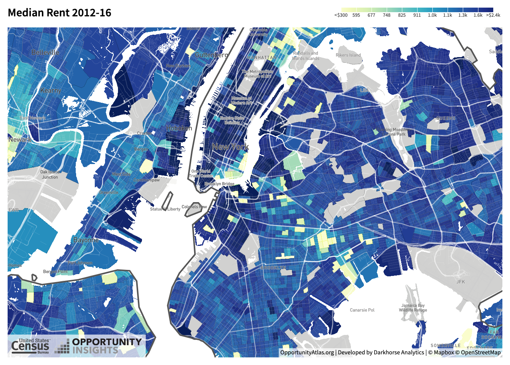
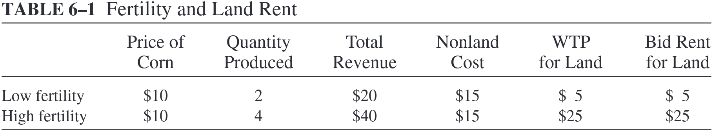
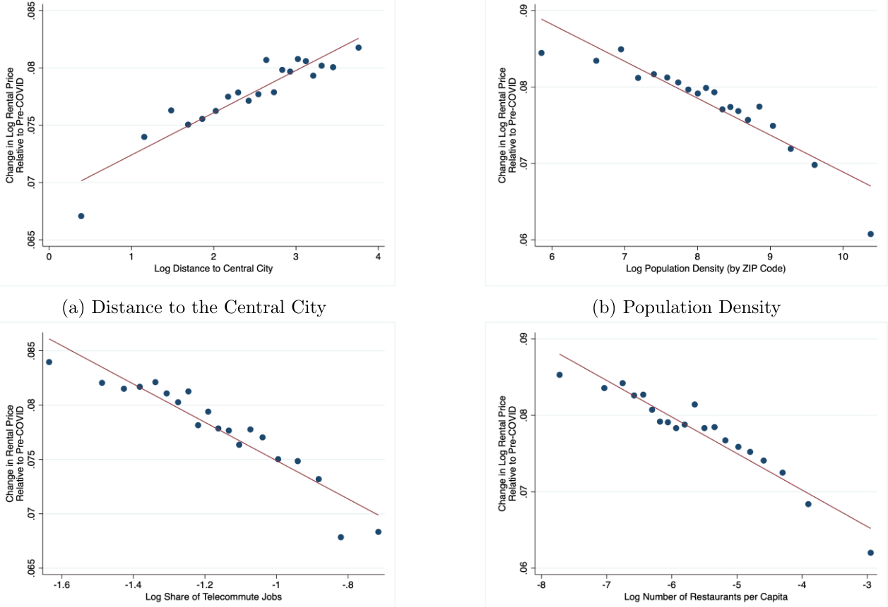
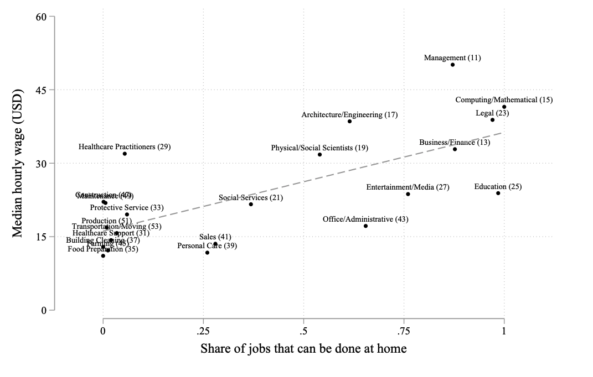
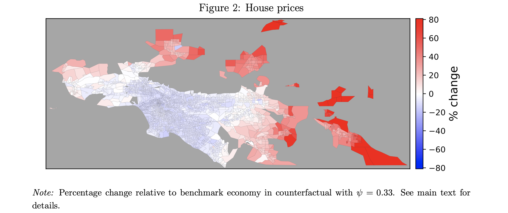

class: inverse, middle

```{R, setup, include = F}
options(htmltools.dir.version = FALSE)
pacman::p_load(
  broom, here, tidyverse, latex2exp, ggplot2, ggthemes, viridis, extrafont,
  gridExtra, kableExtra, dplyr, magrittr, knitr, emo, ggrepel, sf, hrbrthemes
)

# Define colors
## source color script from local directory
## comment out and replace colors if user is not Andrew
source("~/Documents/scripts/colors/colors.R")
blue <- "#4c566a"
purple <- "#b48ead"
red <- "#bf616a"
# XaringanExtra functions
## Tile view
xaringanExtra::use_tile_view()
## Scribble
xaringanExtra::use_scribble()
# Knitr options
opts_chunk$set(
  comment = "#>",
  fig.align = "center",
  fig.height = 7,
  fig.width = 10.5,
  warning = F,
  message = F
)
options(device = function(file, width, height) {
  svg(tempfile(), width = width, height = height)
})
```

```{r, echo=FALSE, include=FALSE, cache=TRUE}

#get data---------------------------------------------------------------------
rent<-  tidycensus::get_acs(
  geography = "county", variables = "DP04_0134",
  state = c("WA", "OR", "CA"), geometry = TRUE
)


pop<-tidycensus::get_acs(
  geography = "county", variables = "B01003_001",
  state = c("WA", "OR", "CA"), geometry = TRUE
)

theme_ip = theme_ipsum(base_family = "Fira Sans Book", base_size = 8)


```

# Content

.hi-white[(i) Intro to rents]

.hi-white[(ii) City "shape"]

---
# Housekeeping

.hi[Assignments:]
- .hi[PS01] was due last night
  - Go over solutions today?
- .hi[PS02] will be posted later this week
  - due date .hi-red[TBD]
- .hi[Reading]
  - finish up to chapter 4 this week
  
--

<br>

.hi[Midterm:]
- Wed, Nov 2
  
---
class: inverse, middle

# Introduction to city shape

---
# Introduction to city shape

.hi[First Week:] philosophicalish questions

--

.pull-left[
  - What is a city?
- Why do cities exist?
  ]
.pull-right[
  - What determines city size?
- How do cities grow?
]

--

.hi[Moving forward:]

--

What economic forces determine .hii[city shape]?

--

- Why does the price of land change?
  
- Why are buildings taller in city centers?

<br>

--

.hi[Questions?]


---
class: inverse, middle, center
# Data

---
# Data: NYC

```{r rent0, include=F, cache=TRUE}
rent_nyc = 
  get_acs(
    geography = "tract", variables = "DP04_0134",
    state = 36, county = c(061, 047, 005, 085, 081), geometry = TRUE
    )
```

```{r rent0_plot, echo=FALSE}
rent_nyc %>%
  ggplot() + 
  geom_sf(aes(fill = estimate, color = estimate)) + 
  coord_sf(crs = 3857) + 
  scale_fill_viridis_c(name = "Rent ($)", labels = scales::comma) + 
  scale_color_viridis_c(name = "Rent ($)", labels = scales::comma) +
  labs(
    title = "Rental rates across NYC", 
    caption = "Data: US Census Bureau"
    ) +
  theme_ipsum()
```

---
# Data: NYC



source: [Oppurtunity Atlas](https://www.opportunityatlas.org/)

---
# Data: US

```{r rent1, include=F, cache=TRUE}
rent_us = 
  get_acs(
    geography = "county", variables = "DP04_0134",
    state = c(1,4:6,8:13, 16:42, 44:51, 53:56), geometry = TRUE
    )
```

```{r rent1_plot, echo=FALSE}
rent_us %>%
  ggplot() + 
  geom_sf(aes(fill = estimate, color = estimate)) + 
  coord_sf(crs = 3857) + 
  scale_fill_viridis_c(name = "Rent ($)", labels = scales::comma) + 
  scale_color_viridis_c(name = "Rent ($)", labels = scales::comma) +
  labs(
    title = "Rental rates across the United States", 
    caption = "Data: US Census Bureau"
    ) +
  theme_ipsum()
```

---
# Data: OR, WA

```{r rent2, include=F, cache=TRUE}
rent_pop_orwa = 
  get_acs(
    geography = "tract", variables = c("B01003_001","DP04_0134"),
    state = c("WA", "OR"), geometry = TRUE
    ) 

rent_pop_orwa$area <- st_area(rent_pop_orwa) |> as.numeric()
```

```{r rent2_plot, echo=FALSE}
rent_pop_orwa %>%
  filter(variable == "DP04_0134") |> 
  ggplot() + 
  geom_sf(aes(fill = estimate, color = estimate)) + 
  coord_sf(crs = 26910) + 
  scale_fill_viridis_c(name = "Rent ($)", labels = scales::comma) + 
  scale_color_viridis_c(name = "Rent ($)", labels = scales::comma) +
  labs(
    title = "Rental rates across Oregon and Washington", 
    caption = "Data: US Census Bureau"
    ) +
  theme_ip
```

---

```{r, rent-pop-plot, echo=FALSE}

rent_pop_orwa |> 
  as_tibble() |> 
  select(NAME, variable, estimate, area) |> 
  pivot_wider(id_cols = c(NAME, area), names_from = variable, values_from = estimate) |> 
  mutate(pop_den = B01003_001 / area) |> 
  ggplot(aes(x = pop_den, y = DP04_0134)) +
    geom_point(size = 1, color = azure, alpha = 0.8) +
    geom_smooth(method = "lm", se = FALSE, size = 0.5, linetype = "dashed",
                color = grey_dark, alpha = 0.5) +
    labs(x = "Population",
         y = "Median rent",
         title = "Correlation between rent and population density in OR and WA",
         caption = "Data: US Census Bureau") +
    theme_ipsum()

```

---
# Introduction to city shape

Imagine you are standing at the center of a large .hi[metropolitan city]
- What do you see as you walk toward the outskirts?

--

Which economic .hi[factors] drive .hi-blue[within-city] location decisions?

--

- .h[Rents]
- .hi[Wages]
- .hii[Other things???] .tiny[`r emo::ji('sparkles')` `r emo::ji('rainbow')` `r emo::ji('sparkles')` .hii[amenities] `r emo::ji('sparkles')` `r emo::ji('rainbow')` `r emo::ji('sparkles')`]

--

Model the .hi-red[rough] historical "shape" of cities considering these factors
- .hi[Today:] How do these choices impact rental prices .hii[within] cities
- .hi[Later:] How do these choices impact rental prices .hii[across] cities

---
name: bid-rent
class: inverse, middle
# Bid-rent curves

---
# Bid-rent curves

.hi[Bid - Rent Curve:] The relationship between rental prices and the distance of land from the city center <sup>.purple[†]</sup>

.footnote[
.purple[†] It actually does not have to be the city center -- can be a point of attraction. In this class we will always use the city center though.
]

.hi[These curves vary across sectors:]

--

- .hii[Housing:] Accessibility to employment (low commuting costs)

--

- .hii[Industrial Space:] Accessibility to consumers and suppliers

--

- .hii[Tech/Office Space:] Accessibility to information

--

<br>

First a super .hi[simple] agricultural land rent model

---
# Agricultural land rent model

.hi[Definitions:]

- .hi[Land rent:] Periodic payment by a land consumer to a landowner

- .hi[Market value:] The amount paid to become the landowner

--

.hi[Setup:]

Rent on a plot of land is determined by how productive the plot is

--

  - .hi[Agriculture:] Price of plot is determined by fertility
  
--

.hii[Consider a setting] where farmers grow corn on two types of land 
.pull-left[
  - High fertility (.hi[HF]): Produces 4 units of corn]
.pull-right[
  - Low fertility (.hii[LF]): Produces 2 unites of corn]
  
---
# Agricultural land rent model

.hi[Assumptions:]
<nobr>
.pull-left[
- .hi[(i)] Farmers rent from landowners
- .hi[(ii)] No barriers to the corn market
- .hi[(iii)] Perfect competition
]
.pull-right[
$TC_{-r} = 15$ (excluding rent)

$TC = 15 + r$ & $P_{corn} = 10$
]

--

.center[.hi[How much will farmers bid for land?]]

--

.pull-left[
.h[Revenue:] $TR = P_{corn} \cdot Q_{corn}$
- .hi[HF:] $TR_{HF} = 10 \cdot 4 = 40$
- .hii[LF:] $TR_{LF} = 10 \cdot 2 = 20$
]

--

.pull-right[
.h[Profit:] $\Pi = TR - TC$
- $\Pi_{HF} = TR_{HF} - TC = 40 - 15 - r$
- $\Pi_{LF} = TR_{LF} - TC = 20 - 15 - r$
]

--

.center[.h[Recall] .h[A05:] Competition drives economic profit to zero]

---
# Agricultural land rent model

--

The following table computes maximum WTP for rent:



Since there are no barriers to entry, if $\Pi > 0$ more firms will enter

- $\Pi \rightarrow 0$

--

- $\Pi_{HF} = TR_{HF} - TC = 40 - 15 - r = 0 \Rightarrow r = 15$
- $\Pi_{LF} = TR_{LF} - TC = 20 - 15 - r = 0 \Rightarrow r = 5$

---
# (i) Housing prices model

Extend the bid-rent model to the housing sector within a city

--

In cities WTP for land depends on .hi[accessibility] rather than productivity

--

.hi[Assumptions:]

.hi[(i)] Commuting costs are the .hi[only] location factor in decision making

--

.hi[(ii)] Only one member of household commutes to employment area

--

.hi[(iii)] They only consider the monetary cost of commuting (no time cost)

--

.hi[(iv)] Noncommuting travel is insignificant

--

.hi[(v)] Public services, taxes, amenities are the same everywhere 
  
--

.center[.hi[Assumptions ensure the employment area is the focal point of the city]]

---
# (i) Housing prices model: Indifference

.hi[A1:] _Housing prices adjust until there is locational indifference_

  - Locational Eq

  - IE: A marginal increase in rent just offsets the lower commuting costs
  
--

We call this the .hi[locational equilibrium condition]; in math:

\begin{align*}
\Delta P \cdot h + \Delta x \cdot t = 0
\end{align*}

where

.pull-left[

- $P$: .hi[Price] of housing (per $ft^2$)

- $h$: .hi[Housing quantity] ( $ft^2$ )

]

.pull-right[

- $x$: .hi[Distance] of commute (miles)

- $t$: .hi[Commuting costs] (per mile)

]

---
# (i) Housing prices model: Bid-Rent 

With locational indifference, we can derive the .hii[slope] of the .hi[bid-rent] curve:

\begin{align*}
\underbrace{\Delta P \cdot h}_{\text{Marginal change in housing cost}} + \underbrace{\Delta x \cdot t}_{\text{Marginal change in commuting cost}} &= 0
\end{align*}


---
# (i) Housing prices model: Bid-Rent 

With locational indifference, we can derive the .hii[slope] of the .hi[bid-rent] curve:

\begin{align*}
\Delta P \cdot h + \Delta x \cdot t &= 0\\
\Delta P \cdot h &= -\Delta x \cdot t
\end{align*}


---
# (i) Housing prices model: Bid-Rent 

With locational indifference, we can derive the .hii[slope] of the .hi[bid-rent] curve:

\begin{align*}
\Delta P \cdot h + \Delta x \cdot t &= 0\\
\Delta P \cdot h &= -\Delta x \cdot t\\
\frac{\Delta P}{\Delta x} &= -\frac{t}{h}
\end{align*}

--

.hi[Notice]: $\frac{\Delta P}{\Delta x}$ is the .purple[slope] of the .hi[bid-rent] curve

--

.hi[Note:] Price on the verticle axis, distance on the horizontal. Rise over run

--

$\Delta P \cdot h  = -\Delta x \cdot t$: Another way of putting this: $MC = MB$! 


---
# (i) Housing prices model: Bid-Rent 

.hi[Alternatively:] Suppose you have decided that the optimal amount of money to spend on housing and commuting per month is $M^*$

- You can allocate this as

\begin{align*}
P\cdot h + x \cdot  t = M^*
\end{align*}


- Since we graph the bid rent curve in the $(x,P)$ space, we solve for $P$:

--

\begin{align*}
P\cdot h + x \cdot  t &= M^*\\
P\cdot h &= M^* - x\cdot t
\end{align*}


---
# (i) Housing prices model: Bid-Rent 

.hi[Alternatively:] Suppose you have decided that the optimal amount of money to spend on housing and commuting per month is $M^*$

- You can allocate this as

\begin{align*}
P\cdot h + x \cdot  t = M^*
\end{align*}

- Since we graph the bid rent curve in the $(x,P)$ space, we solve for $P$:

\begin{align*}
P\cdot h + x \cdot  t &= M^*\\
P\cdot h &= M^* - x\cdot t\\
P &= \frac{M^*}{h} - \frac{t}{h} \cdot x
\end{align*}

--

- Slope: $\Delta P = 0 - \frac{t}{h} \cdot \Delta x \implies \frac{\Delta P}{\Delta x} = -\frac{t}{h}$

--

We can use calculus and take derivative if $P$ w.r.t $x$ and get the same thing

---
# (i) Housing prices model: Example 

.hi[Suppose the following:]
- Each household has $800 a month to spend on housing and commuting
- All rental units are the same size (_1000 sq/ft_), one HH occupying each
- Monthly commuting cost is $50 dollars per mile from city center

--

<br>

.hi[Task]: Draw the housing - price curve.
- Put miles from city center on .hii[x axis] and price per square foot on .hi[y axis]


---

--

# Example: The housing price curve

```{R, bid_rent_nosub, echo=F,fig.height = 4, fig.width = 7, dev = "svg", cache=T}

bid_rent <- function(x) .8 - .5*x

ggplot(data.frame(x=c(0, 10)), aes(x)) + 
  stat_function(fun= bid_rent, col = purple)+
  xlim(0,1.6)+
  ylim(-.2,1)+
  geom_vline(xintercept =0, size = 0.5) +
  geom_hline(yintercept =0, size = 0.5)+
  theme_ip +
  labs(x = "10s of miles from city center", y = "Price of housing (per square foot)")+
  geom_text(x =0, y= .8, label = "a", hjust=2)+
  geom_text(x=1.6, y =0, label = "b",vjust= 2)

```

.hi[a:] Max WTP for a square foot (at center of city) (80 c per square foot)

.hi[b:] Furthest away from center HH is willing to live (16 miles)

---
# (i) Housing prices model: Substitution

.hi[Q]: If you are trying to move to a better area, would you choose to sacrifice (_"substitute"_) apartment size?

--

.center[.hii[A]: Probably yes. Most people are willing to .blue[substitute]]

--

.hi[Q]: What do I mean by .blue[substitute]? Substitute what?

--

.center[.hii[A]: Substitute housing consumption for .blue[lower commuting cost] ]

.center[( or anything else being close to the center of the city gets you)]

---
# (i) Housing prices model: Substitution

Let's formalize the mechanism for substitution a bit:

--

 .hii[higher prices] $\implies$ .hi[higher oppurtunity cost] per square foot of housing
 
--

- As rent $\uparrow$, consumers are likely to substitute towards other goods

  - decreasing the square footage of housing demanded

--

<br>

.hi[Housing units closer to city centers are thus likely to be smaller in size]

---
# Adding substitution to the model

.hi[Q:] Did our model of locational indifference accommodate for substitution?

\begin{align*}
\Delta P \cdot h + \Delta x \cdot t &= 0
\end{align*}

--

.hi[A:] No because $h$ is .hi[independent of distance] from center, $x$ 

- $h$ (_quantity of housing consumed_) is .hi[exogenous] in the model

--


_If consumers can .hi[substitute]_, our locational indifference condition becomes:

--

\begin{align*}
\Delta P \cdot h(x)  + \Delta x \cdot t = 0 
\end{align*}

--

Where $h(x)$ is an _increasing_ function of x 

--

.hi[Ex]: $h(10) > h(5)$
- Quantity of housing demanded 10 miles away exceeds that of 5 miles

---
class: inverse, middle
# Manufacturing Bid-Rent

---
# Manufacturing Bid Rent

WTP for land from manufacturing firms is a function of accessibility

--

Urban manufacturing employment is largely decentralized
- Most firms locate close to the highway. .hi[Why?]

--

<br>

Firms are balancing .hi[freight] and .hii[labor costs]
  
- Further from labor $\implies$ .hii[higher wage] (compensating commuting costs)
  
- Further from shipping center $\implies$ .hi[higher freight cost]

---
# Manufacturing Bid Rent

Let's start with a simple model. .hi[Assumptions:]

--

.hi[(i)] .hi[Input prices], .hii[output prices] & .hi-light-grey[quantities] are fixed 
- Firms only decides location
  
--

.hi[(ii)] Firms import and export output to/from cities via a .hi[central terminal]
- Train, harbor, etc.
- Horse drawn carts are used to bring goods to terminal

--

.hi[(iii)] Wage are a function of commute time. 

- Wage is highest at center

---
# Firm's Bid Rent

What do we use to get the firm's bid - rent equation?

.hi[A5:] _.hi[Competition generates zero economic profit]_

--

Recall the profit equation:

\begin{align*}
\pi = TR - TC
\end{align*}


--

In this model:


--

- $TR = P*Q$ (fixed, exogenous, i will tell you)

--

- $TC$ is a function of freight cost, labor cost, and intermediate goods cost

\begin{align*}
TC(x) = \text{Freight Cost}(x)+ \text{Labor Cost}(x) + \text{Land Cost}(x)+\\
\text{Intermediate Input Cost}
\end{align*}

---
# Firm Bid Rent

From here on out, let's call $\text{Intermediate Input Cost} = \bar{I}$


- Invoking zero economic profit, from the last slide we can write:

--

\begin{align*}
TR - (\text{Freight Cost}(x)+ \text{Labor Cost}(x) +\text{Land Cost}(x) +\bar{I} ) = 0
\end{align*}

--

.center[.hi[In words]: .blue[The most a firm would be willing to pay for land then is revenue net of non land cost]]

Rearranging:

--

\begin{align*}
\text{Land Cost}(x) = TR - \text{Freight Cost}(x) - \text{Labor Cost}(x) - \bar{I}
\end{align*}

--

.hi[Note]: Land Cost = $P(x)*L_m$, where:


- $P(x)$ is the _.blue[price of land at x miles away from the center]_

- $L_m$ is the _.orange[amount of land the manufacturer uses in production]_

---


# Firm Bid Rent: Equation

We can replace land cost with $P(x)* L_m$ to get the equation for the .hi[manufacturing bid rent] curve

--

\begin{align*}
P(x)*L_m = TR - \text{Freight Cost}(x) - \text{Labor Cost}(x) - \bar{I}
\end{align*}

---
# Firm Bid Rent: Equation

We can replace land cost with $P(x)* L_m$ to get the equation for the .hi[manufacturing bid rent] curve


\begin{align*}
P(x)*L_m &= TR - \text{Freight Cost}(x) - \text{Labor Cost}(x) - \bar{I}\\
P(x) &= \frac{TR - \text{Freight Cost}(x) - \text{Labor Cost}(x) - \bar{I}}{L_m}
\end{align*}

--

.hi[Comparative statics:]

--

.hi[In words], this equation says:

--

- Higher revenues $\implies$ higher land prices .hi-light-grey[for every distance] $x$

- An increase in freight costs, labor costs, or intermediate input costs will __decrease__ the price for every distance $x$

---

# Example

.hi[Suppose:]

$P = 5$, $Q = 2$, $FC(x) = 4x$, $\texttt{Labor}(x) = 1-3x$, $L_m =1$, $\bar{I} = 0$

(i) Derive the firm's bid rent curve. Carefully write down your steps

(ii) What is the price the firm is willing to pay for land at $x = 1$?

(iii) Is the WTP higher or lower when we move away from the center?

(iv) What distance away from the center is the WTP zero?

---
# Example

.hi[(i)] Start with zero profit condition:

$\pi(x) = 0 \implies TR - FC(x) - LC(x) - P(x) = 0$

Plugging in:
\begin{align*}
5\times 2 - 4x-(1-3x)-P(x) &= 0\\
9 - x &=P(x) 
\end{align*}

.hi[(ii)] $P(1) = 8$

.hi[(iii)] Lower (if $x_2 > x_1$, $P(x_2) < P(x_1)$)

.hi[(iv)] $P(x)=0 \implies x= 9$

---
# Back to Reality

How can a model like this help us understand the industrial revolution?

  - What happened to freight costs? .hi[They fell] A few innovations:

--

.hi[Transportation Innovations:]
.pull-left[
- Omnibus (1827)
- Cable Cars (1873)]
.pull-right[
- Electric Trolley (1886)
- Subways (1895)]

--

In our model, what do these innovations do?

--

.hi[Decrease labor costs relative to freight]

---
# More History 

The _intracity_ truck ([1910](https://i.pinimg.com/originals/fc/76/38/fc7638989799ddf18d1b651805edc3fa.jpg)): 2x faster and half as costly as the horse-drawn wagon<sup>.pink[†]</sup>

--

- Decreased cost of moving output .hi[relative] to cost of moving workers

- Manufacturing firms moved closer to low-wage suburbs

--

_Intercity_ truck ([1930](https://c8.alamy.com/comp/2A2WX3J/negative-thornycroft-truck-loaded-with-drapery-ironmongery-homewares-wangaratta-district-victoria-circa-1930s-a-man-standing-beside-a-3-axle-thornycroft-truck-the-truck-advertises-drapery-and-clothing-china-and-glassware-and-ironmongery-and-tinware-2A2WX3J.jpg)): alternative to ships and rail<sup>.pink[††]</sup>

.footnote[
.pink[†] Intra = Within 
.pink[††] Inter = Across
]

--

- .hi[Highways]: Industry shifted from .hii[ports] and .hii[railroad terminals] to .hi[roads]

--

- .hi[Modern cities]: Industry oriented toward highways and beltways 
  - Freight costs decreased relative to labor

---
class: inverse, middle, center
# (iii) Office space bid-rent

---
# (iii) Office space bid-rent

Final rent bidders we will consider - .hi[offices]

--

Same as the other bidders, WTP for land depends on accessibility

--

.center[.hi[Why?]]

--

Office firms use high skilled labor- _face to face_ interaction is productive

- Proximity to other office firms is an important input

--

.hi[Oppurtunity cost] of high skilled labor is greater than other types of labor


---


# Office Bid Rent

So as office firms get further from center their "transit" cost goes up. So what must happen to WTP? 

--

```{R, office_plot, echo=F,fig.height = 5, fig.width = 8, dev = "svg", cache=T}


office <- function(x)  20 / (1+x)

ggplot(data.frame(x=c(0, 20)), aes(x)) + 
  stat_function(fun= office, col = "purple")+
  geom_vline(xintercept = 0)+
  geom_hline(yintercept = 0)+
  labs(x = "Distance to center", y = "Price (WTP)")+
  ggthemes::theme_pander(base_family = "LM Roman 10")


```

---
# City Organization

.center[.hi[How do we put all of this together?]]

--

.center[.hi[Why are these called __bid__ rent curves?]]

--

.hi[Land will be allocated to highest bidder]
- This will vary by location in the city

--

.hi[Example:] Assume profit for office and manufacturing is given by

--

$\pi_{\text{office}} = 105 - P(x_{\text{Office}}) - (5 + 4\times x_{\text{office}})$

$\pi_{\text{manufact}}=  75 - P(x_{\text{manufact}}) - (5 + 2\times x_{\text{manufact}})$

--

For consumers, they can allocate money between housing and commuting:

$r(x_\text{commuter}) =  \frac{50}{2} - \frac{1}{2}\times x_\text{commuter}$

---
# Example

$\pi_{\text{office}} = 105 - r(x_{\text{Office}}) - (5 + 4\times x_{\text{office}})$

$\pi_{\text{manufact}}=  75 - r(x_{\text{manufact}}) - (5 + 2\times x_{\text{manufact}})$

$r(x_\text{commuter}) =  \frac{100}{4} - \frac{2}{4}\times x_\text{commuter}$

--

.ul[.hi[Task]: ]

.hi[(i)] Derive the bid rent curve for office space, manufacturing, and commuters. Plot all of them. 

--

.hi[(ii)] Find how land is allocated. What range from the center is:
  - Office space
  - Manufacturing space
  - Housing space?

---

# Example

--

```{R, city_plot, echo=F,fig.height = 5, fig.width = 8, dev = "svg", cache=T}

office2 <- function(x)  105 - (5+ 4*x)
manuf <- function(x)  75 - (5+ 2*x)
home <- function(x)  25 - .5*x

ggplot(data.frame(x=c(0, 65)), aes(x)) + 
  stat_function(fun= office2, col = blue)+
  stat_function(fun= manuf, col = purple)+
  stat_function(fun= home, col = red)+
  geom_vline(xintercept = 0)+
  geom_hline(yintercept = 0)+
  labs(x = "Distance to center", y = "Price (WTP)")+
  ggthemes::theme_pander(base_family = "LM Roman 10")+
  ylim(-1,100)+
  geom_segment(x = 15, xend = 15, y=0, yend = 40, linetype = "dashed")+
  geom_segment(x = 30, xend = 30, y=0, yend = 10, linetype = "dashed")+
  geom_text(x = 15, y= 0, label = "x_1 = 15", vjust = 2)+
  geom_text(x = 30, y= 0, label = "x_2 = 30", vjust = 2)
  

```

---
# Example

Bid rent curves for office and manufacturing come from zero profit. Commuters curve was given.


- Office: $r(x_{\text{office}}) = 105 - (5+4 \times  x_{\text{office}})$

- Manufacturing: $r(x_{\text{manufact}}) = 75 - (5+2 \times x_{\text{manufact}})$

- Commuters: (given) $r(x_\text{commuter}) =  \frac{100}{4} - \frac{2}{4}\times x_\text{commuter}$


--

- Office firms locate in the range of $x$ in $[0,15]$

-  Manufacturing firms locate in the range of $x$ in $[15,30]$

- Commuters locate in the range of $x$ in $[30,50]$

---

# Bonus: COVID19 and Cities research

.hi[Questions:]

__Q1)__ How does COVID19 impact housing/rental prices?
  
  - Is the effect the same everywhere? Why or why not?
  
__Q2)__ How many jobs can be done remotely? Does this vary systematically across sectors? Cities?
  
__Q3)__ What do we think will happen to city structure as a result of increased (potentially permanent) WFH
  
  
---

# Bonus: COVID19 and Cities Research

__Q1)__  How does COVID19 impact housing/rental prices?

  - .hi[A1:] [_The Impact of the COVID-19 Pandemic on the Demand for Density: Evidence from the U.S. Housing Market_](https://dallasfed.frswebservices.org/research/papers/2020/wp2024.aspx) (.pink[Liu & Su, 2020])
  
__Findings:__

> The pandemic has led to a greater decline in the demand for housing in neighborhoods with high population density. We further show that the reduced demand for density is partially driven by the diminished need of living close to jobs that are telework-compatible and the declining value of access to consumption amenities.

---


count: false
# Bonus: COVID19 and Cities Research

  - .hi[A1:] [_The Impact of the COVID-19 Pandemic on the Demand for Density: Evidence from the U.S. Housing Market_](https://dallasfed.frswebservices.org/research/papers/2020/wp2024.aspx) (.pink[Liu & Su, 2020])
```{R, covid_prices,out.width = "80%", out.height = "80%", echo = F}

```
  
---


# Bonus: COVID19 and Cities research

__Q2)__ How many jobs can be done remotely? Does this vary systematically across sectors? Cities?


- .hi[A2:] [_How many jobs can be done at home?_](https://www.nber.org/system/files/working_papers/w26948/w26948.pdf) (.pink[Dingel & Nieman, 2020])


> We find that 37 percent of jobs in the United States can be performed entirely at home, with significant variation across cities andindustries. These jobs typically pay more than jobs that cannot be done at home and account for 46 percent of all US wages.

 

---

count: false
# Bonus: COVID19 and Cities research


 - .hi[A2:]  [_How many jobs can be done at home?_](https://www.nber.org/system/files/working_papers/w26948/w26948.pdf) (.pink[Dingel & Nieman, 2020])
```{R, share_home,out.width = "80%", out.height = "80%", echo = F}

```

---

# Bonus: COVID19 and Cities research

__Q3)__ What do we think will happen to city structure as a result of increased (potentially permanent) WFH?

 - .hi[A3:] [_How Do Cities Change When We Work from Home?_](https://www.andrii-parkhomenko.net/files/DKP_Covid_Urban.pdf) (.pink[Delventhal et. al, 2020])


__Main Predictions:__

> 1) Jobs move to the core of the city, while residents move to the periphery.

> 2) Traffic congestion eases and travel times drop.

> 3) Average real estate prices fall, with declines in core locations and increases in the periphery.


---

count: false
# Bonus: COVID19 and Cities research

__Q3)__ What do we think will happen to city structure as a result of increased (potentially permanent) WFH?

 - .hi[A3:] [_How Do Cities Change When We Work from Home?_](https://www.andrii-parkhomenko.net/files/DKP_Covid_Urban.pdf) (.pink[Delventhal et. al, 2020])


```{R, kwon_wfh, echo = F}

```


---


class: inverse, middle
# Checklist

.pull-left[
1) .hi[Intro to Rents] `r emo::ji("check")`

1.5) .hi[Bonus: COVID19 and Cities] `r emo::ji("check")`

2) .hi[Consumer Bid Rent] `r emo::ji("check")`

3) .hi[Manufacturing Bid Rent] `r emo::ji("check")`

4) .hi[City Shape] `r emo::ji("check")`

]

---


<!-- --- -->
<!-- exclude: true -->

<!-- ```{R, generate pdfs, include = F} -->
<!-- system("decktape remark 02_goodsmarket_part1.html 02_goodsmarket_part1.pdf --chrome-arg=--allow-file-access-from-files") -->
<!-- ``` -->


