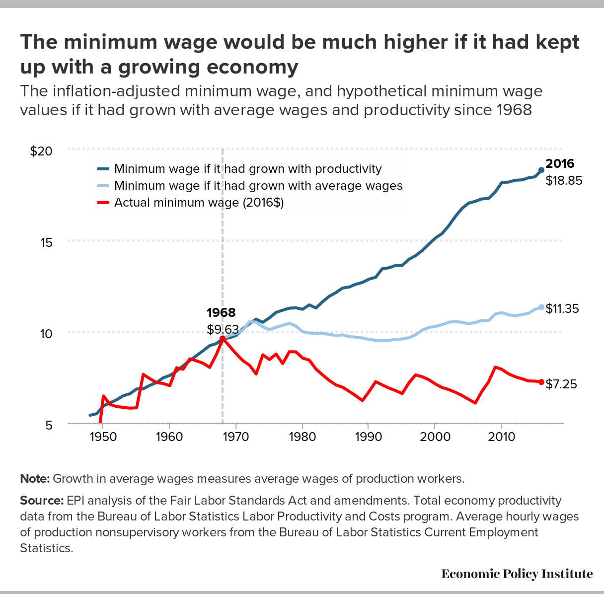
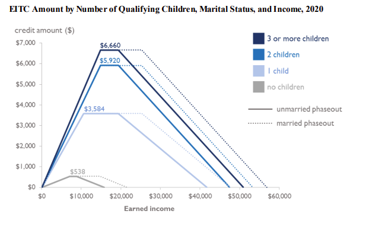
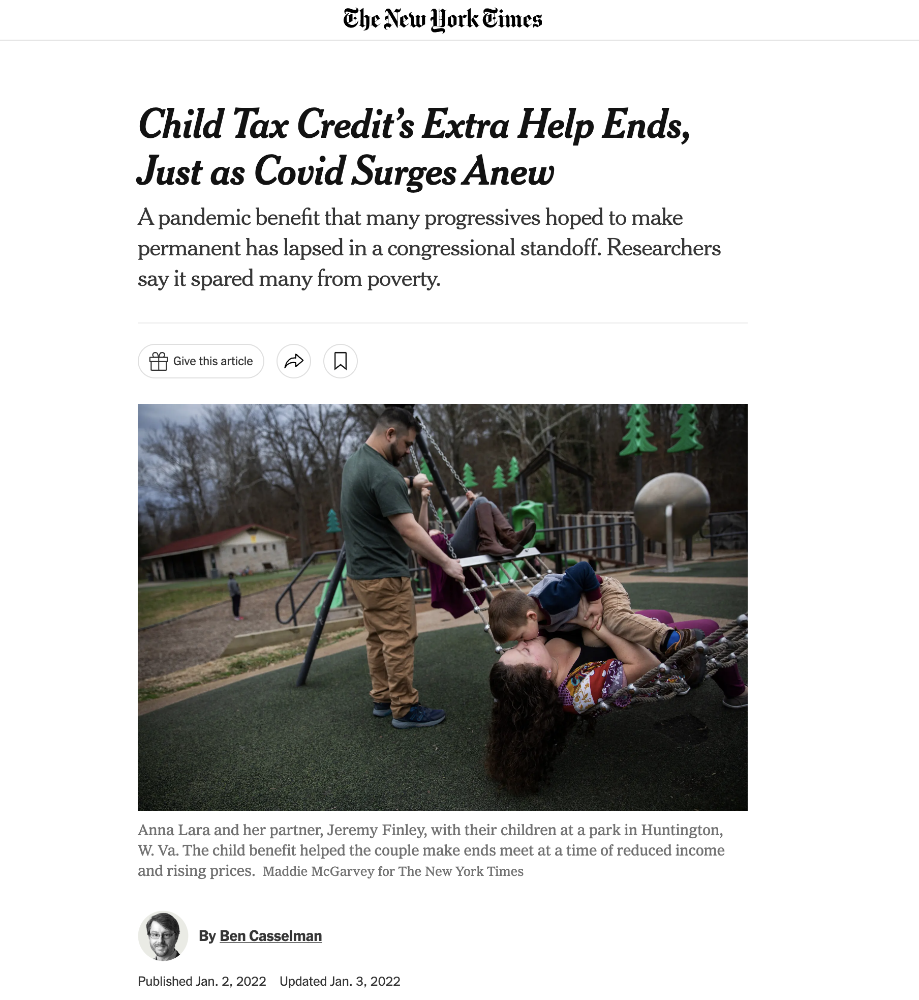

class: inverse, center

```{R, setup, include = F}
options(htmltools.dir.version = FALSE)
pacman::p_load(
  broom, here, tidyverse, latex2exp, ggplot2, viridis, extrafont,
  gridExtra, kableExtra, dplyr, magrittr, knitr, emo, ggrepel, sf, hrbrthemes
)

# Define colors
## source color script from local directory
## comment out and replace colors if user is not Andrew
source("~/Documents/scripts/colors/colors.R")
blue <- "#4c566a"
purple <- "#b48ead"
red <- "#bf616a"
# XaringanExtra functions
## Tile view
xaringanExtra::use_tile_view()
## Scribble
xaringanExtra::use_scribble()
# Knitr options
opts_chunk$set(
  comment = "#>",
  fig.align = "center",
  fig.height = 7,
  fig.width = 10.5,
  warning = F,
  message = F
)
options(device = function(file, width, height) {
  svg(tempfile(), width = width, height = height)
})

mytheme = theme_ipsum(base_family = "Fira Sans Book", base_size = 20) + theme(panel.grid.minor.x = element_blank(),
      axis.title.x = element_text(size = 20),
      axis.title.y = element_text(size = 20))
```


class: inverse, middle
# Content

.hi-white[(i) History of the minimum wage]

.hi-white[(ii) Causal inference]


---
# Housekeeping

.pull-left[
.hi[PS03] _(due Mon, Nov. 21)_
- Posted now (a couple of minutes ago)
]

.pull-right[
.hi[PS04] _(due Wed, Nov. 30)_
- will be posted by Mon next week
]

--

.hi[TotC book report] _(due Thu, Dec. 8)_
- Short (1000 words) assignment 
- rubric posted on canvas and on the course repo
- will be checking for plagiarism 

--

.hi-red[Final] _(14:45 Wed, Dec. 7)_
- [final schedule](https://registrar.uoregon.edu/calendars/examinations)
- Comprehensive exam with an emphasis on the newer material


---

class: inverse, middle
# History of the minimum wage

---
# History of the minimum wage


.pull-left[
- __1894__: New Zealand enacts the [Industrial Concilation and Arbitration Act](https://en.wikipedia.org/wiki/Industrial_Conciliation_and_Arbitration_Act_1894)

  - Worlds first Min wage!


]

.pull-right[

]


---


count: false
# A Brief History Lesson


.pull-left[
- .ex[__1894__: New Zealand enacts the [Industrial Concilation and Arbitration Act](https://en.wikipedia.org/wiki/Industrial_Conciliation_and_Arbitration_Act_1894)]

  - .ex[Worlds first Min wage!]
  
- __1912__: Massachusetts enacts the .pink[first minimum wage in the US]. Other states follow


]

.pull-right[

]


---

count: false
# A Brief History Lesson


.pull-left[
- .ex[1894: New Zealand enacts the [Industrial Concilation and Arbitration Act](https://en.wikipedia.org/wiki/Industrial_Conciliation_and_Arbitration_Act_1894)]

  - .ex[Worlds first Min wage!]
  
- .ex[__1912__: Massachusetts enacts the .pink[first minimum wage in the US]. Other states follow]

-  __1938__: [Fair Labor Standards Act](https://www.dol.gov/agencies/whd/flsa) (25 cents per hour .hi[federal] minimum wage)


]

.pull-right[

]


---


count: false
# A Brief History Lesson


.pull-left[
- .ex[1894: New Zealand enacts the [Industrial Concilation and Arbitration Act](https://en.wikipedia.org/wiki/Industrial_Conciliation_and_Arbitration_Act_1894)]

  - .ex[Worlds first Min wage!]
  
- .ex[__1912__: Massachusetts enacts the .pink[first minimum wage in the US]. Other states follow]

-  .ex[__1938__: [Fair Labor Standards Act](https://www.dol.gov/agencies/whd/flsa) (25 cents per hour .hi[federal] minimum wage)]


]

.pull-right[

- __1968__: Federal Minimum Wage reaches .hi[peak purchasing power] at $1.60 per hour ($11.53 in 2019 dollars) `r emo::ji("exploding_head")`

]


---


count: false
# A Brief History Lesson


.pull-left[
- .ex[1894: New Zealand enacts the [Industrial Concilation and Arbitration Act](https://en.wikipedia.org/wiki/Industrial_Conciliation_and_Arbitration_Act_1894)]

  - .ex[Worlds first Min wage!]
  
- .ex[__1912__: Massachusetts enacts the .pink[first minimum wage in the US]. Other states follow]

-  .ex[__1938__: [Fair Labor Standards Act](https://www.dol.gov/agencies/whd/flsa) (25 cents per hour .hi[federal] minimum wage)]


]

.pull-right[

- .ex[__1968__: Federal Minimum Wage reaches .hi[peak purchasing power] at $1.60 per hour ($11.53 in 2019 dollars) `r emo::ji("exploding_head")`]

-  __2009__: Min wage is $ 7.25 an hour

-  __2019__: 29 states have a higher minimum wage than federal

]

---
# History of the minimum wage

.center[

]


---


# Minimum wage discussion

So what do you think? Is minimum wage good? Is it bad?

--

.hi[Note]: The question _is minimum wage good?_ is .hi[not] a good question.

--

Good is .hii[normative]

.hi[Better:] Does minimum wage impact all low wage workers .hi[equally?]

--

Does minimum wage cause increases in unemployment?

--

Does minimum wage lead to firms reducing other, non-mandated benefits?

--

Above questions: quantifiable, with answers that can (and should?) be answered empirically


---
# Recent legistlation

_Raise the Wage Act of 2021:_
 
 
> If enacted at the end of March 2021, the Raise the Wage Act of 2021 (S. 53, as introduced on January 26, 2021) would raise the federal minimum wage, in annual increments, to $15 per hour by June 2025 and then adjust it to increase at the same rate as median hourly wages. 


[CBO on the Raise the Wage Act of 2021](https://www.cbo.gov/publication/56975):

> Employment would be reduced by 1.4 million workers, or 0.9 percent, according to CBO’s average estimate; and

> The number of people in poverty would be reduced by 0.9 million.


---

# Recent Empirical Work

[Cengiz et. al (2021)](https://www.nber.org/papers/w28399#.YBhGmiEqePo.twitter): 

> By exploiting 172 prominent minimum wages between 1979 and 2019 we find that there is a very clear increase in average wages of workers in these groups following a minimum wage increase, while there is little evidence of employment loss. Furthermore, we find no indication that minimum wage has a negative effect on the unemployment rate, on the labor force participation, or on the labor market transitions.

---

# Recent Empirical Work

[Jardim et al (2018)](https://www.nber.org/system/files/working_papers/w23532/w23532.pdf): "The" Seattle Min Wage Paper (now peer reviewed):

> This paper evaluates the wage, employment, and hours effects of the first and second phase-in of the
Seattle Minimum Wage Ordinance, which raised the minimum wage from $9.47 to as much as $11
in 2015 and to as much as $13 in 2016. ..... we conclude that the second wage increase to $13
reduced hours worked in low-wage jobs by 6-7 percent, while hourly wages in such jobs increased
by 3 percent. Consequently, total payroll for such jobs decreased, implying that the Ordinance lowered
the amount paid to workers in low-wage jobs by an average of $74 per month per job in 2016. Evidence
attributes more modest effects to the first wage increase. We estimate an effect of zero when analyzing
employment in the restaurant industry at all wage levels, comparable to many prior studies.

---
# Recap

Overall, the effects of min wage on all kinds of outcomes is still debated.

  - Why is it not surprising that results from differ across cities?
  
  - Geographic varying labor market power!  (Some places/sectors are closer to competitive, others monopsony)
  
As always, more work to do here. A lot more research on this topic we don't have time to go over. But: how does anyone figure any of this stuff out?


---
class: inverse, middle
# Causal inference

---

# Causal inference: Introduction

We are going to talk about .hi[causality]. 

Some of these notes are based on written by [Ed Rubin](http://edrub.in/) & [Kyle Raze](https://kyleraze.com/)

---
# Causal inference: Introduction

Historically, social sciences had limited data to study policy questions. 

.hi[Result:] Social sciences were .hi[theoretical] fields

  - Economists used .hii[mathematical models]
  - Sociologists developed .hi[qualitative theories]
  - Both used their theories to make policy recommendations

--

.hii[Problem:] Theories can be (and often are) wrong

  - 5 economists often have 5 answers to the same question
  - Leads to a politicization of questions that, in principle, have scientific answers (ie: does minimum wage cause increased in unemployment?)


---
# Causal revolution

.hi[Today:] social sciences are increasingly .hii[empirical] thanks to the growing availability of data
- Ability to test and improve theories using real data
- Data driven answers $\implies$ less politicization
  
--

Furthermore, the .hi[causal revolution] that started 30 years ago in other fields such as statistics, computer science (AI), psychology etc has given us the tools (language) to make causal statements 


---
# Causal inference

The economists toolkit:
- .hi[Empirics:] tells us what actually happened
- .hi.purple[Theory:] helps us understand why things happened the way they did
  
--

Be careful in distinguishing between:
- .hi[Empirical facts] such as _average unemployment was lower after minimum wage was placed_
- .hii[Empirical or theoretical claims] (supported by facts) such as: _average unemployment was lower .hi.purple[because] of minimum wage_ or

---
# Causal revolution: Counterfactual


Suppose we want to answer the question:

 _Does minimum wage lead to increases in unemployment_?
 
 .hi[What would be the best way to answer this question?]
 
--

.hi[Definition: Counterfactual]

> The outcome of a policy (or event or treatment) had that policy not happenend

--

The perfect counterfactual in a parallel universe

---
# The ideal experiment

.hi[Suppose we want to answer the question:] _Does minimum wage lead to increases in unemployment_?

--

What would be the .hii[ideal experiment] with unlimited resources and data?

--

.hii[(i)] Implement minimum wage in one state - New Jersey

--

.hii[(ii)] Compute unemployment in NJ .hi[post minimum wage] and call it $u_{\text{m, NJ}}$

--

.hii[(iii)] Have a .hi[parallel universe] in which you did not implement min wage in NJ. Compute $u_{\text{w, NJ}}$

--

.hii[(iv)] .hi[Treatment effect] of the min wage for NJ, given by: $$\tau_{text{m, NJ}} = u_{\text{m, NJ}} - u_{\text{w, NJ}}$$ 

---
# Issues with the ideal experiment


Unfortunately, we do not have a parallel universe at our disposal

--

This is called the .hi[fundamental problem of causal inference]

- We will never observe two parallel universes- treated and untreated

--

We can never _guarantee_ all else is equal, but we will try our best.

--

.hi[Q:] How can we answer this question, without a parallel universe?

---
# Setup

.hi[Q:]  _Does minimum wage lead to increases in unemployment_?

We need a setting: in 1993 NJ rose minimum wage from 4.25 to 5.05.

--

.hi[Q:] What .hi[comparisons could you make] to under the the effect of NJ min wage on unemployment?

--

.hi[(i)] Compare average unemployment in NJ .hii[before] and .hi[after] the policy

--

.hi[(ii)] Also could compare average unemployment in .hii[NJ] to .hi[other states]

--

.hi[Q:] .hi[Problems?]

--

.hii[(i)] Other factors could be influencing unemployment at same time as NJ as min wage implementation

--

.hii[(ii)] Could be _many_ things that cause average wages to be different in NJ and other states (not related to min wage)


---
# Issues

A .hi[causal statement] is a .hii[high bar]

Both issues were violations of the _.hii[all else equal]_ assumption

--

Otherwise known broadly as .hi[Endogeneity], .hii[Simultaneous Equations], or .hi-green[Selection Bias]

--

When _.hii[all]_ factors are held constant, statistical comparisons detect .hi[causal relationships]. You have likely heard the saying:

> Correlation is not causation

--

- Often times there are violations of the .hii[all else equal assumption]

--

.hi[New saying:]

  > Correlation + all else equal is causation.
  
---
# Path to Causality

The MW comparison we made violates the .hii[all else equal] assumption

How might we solve this problem?

--

.center[.hi[Random Experiments]]

--

Randomization helps us maintain the .hi[_all else equal_] assumption 

--

Here we have two groups:
- .hi[Treatment:] Assigned minimum wage
- .hi[Control:] Not assigned minimum wage

--

.hi[Average Treatment Effect:] ATE = Average(treated) - Average(control)
- Unobservable/observable differences average out to zero due to random assignment
  
---
# Problem

We can't randomly assign firms to minimum wage. If we _invited_ firms to participate (very few would, probably), we would have .hi-green[selection bias] (non-random assignment of treatment)
- Simple comparisons of treatment vs control might violate .hi[_all else equal_]

--

.hi[What do we do?]

--

.hi[(i)] Give up

--

.hi[(ii)] .hi[Think of a different comparison that gets us closer to all else equal.]

---

# A difference in differences

.hi[We tried:]

.hi[(i)] Comparing NJ to itself before and after the policy `r emo::ji("x")`

--

.hi[(ii)] Comparing NJ to another state after the policy `r emo::ji("x")`

--

.hii[Another idea:] Take two differences

--

What if we .hii[compared the difference] between NJ and another state .hi[before] & after the minimum wage?

--

If the .hii[pre-treatment] difference is constant, then comparing this to the .hi[post-treatment] should give us the treatment effect of the policy.
  
--

This is called the .hi[Difference in Differences] estimator (DiD)

---
# Differences-in-Differences 

.hi[Card and Krueger (1994)]

.center[**Effect of Minimum Wage on Employment**]
```{R, echo = F, escape = F}
tab<-data.frame(
  v1 = c(".blue[Treatment (NJ)]", ".purple[Control (PA)]", "Difference" ),
  v2 = c(21.03, 21.17, ""),
  v3 = c(20.44, 23.33,"")
  
) %>% kable(
  escape = F,
  col.names = c("Group", "After", "Before"),
  align = c("l", "c", "c"),
  caption = "Outcome: Number Full-Time Workers"
) %>%
  kable_styling() %>% 
  row_spec(1:2, extra_css = "line-height: 110%;")
tab
```

Difference-in-differences .mono[=]

---
count: false
# Differences-in-Differences 

.hi[Card and Krueger (1994)]

.center[**Effect of Minimum Wage on Employment**]
```{R, echo = F, escape = F}
tab<-data.frame(
  v1 = c(".blue[Treatment (NJ)]", ".purple[Control (PA)]", "Difference" ),
  v2 = c(21.03, 21.17, -0.14),
  v3 = c(20.44, 23.33, -2.89)
  
) %>% kable(
  escape = F,
  col.names = c("Group", "After", "Before"),
  align = c("l", "c", "c"),
  caption = "Outcome: Number Full-Time Workers"
) %>%
  kable_styling() %>% 
  row_spec(1:2, extra_css = "line-height: 110%;")
tab
```

Difference-in-differences .mono[=]

---
count: false
# Differences-in-Differences 

.hi[Card and Krueger (1994)]

.center[**Effect of Minimum Wage on Employment**]
```{R, echo = F, escape = F}

tab<-data.frame(
  v1 = c(".blue[Treatment (NJ)]", ".purple[Control (PA)]", "Difference" ),
  v2 = c(21.03, 21.17, -0.14),
  v3 = c(20.44, 23.33, -2.89)
  
) %>% kable(
  escape = F,
  col.names = c("Group", "After", "Before"),
  align = c("l", "c", "c"),
  caption = "Outcome: Number Full-Time Workers"
) %>%
  kable_styling() %>% 
  row_spec(1:2, extra_css = "line-height: 110%;")
tab

```

Difference-in-differences .mono[=] -.blue[0.14] .mono[-] .purple[-2.89]
--
<br> $\quad$ .mono[=] 2.75. ( a .hi[13%] increase!!)

--

.hi[Result:] Increasing the minimum wage did not reduce employment!

---
# DiD Plot

```{R, did_1, echo=F,fig.height = 5, fig.width = 8, dev = "svg", cache=F}

ggplot()+
  labs(x = "time")+
  mytheme +
  geom_hline(yintercept = 18)+
  geom_vline(xintercept = 0)+
  ylim(18,22)+
  annotate(x = 2.5,y = 21.17, label = "treatment group (pre-policy)", "text")+
  annotate(x = 2.5,y = 20.17, label = "control group (pre-policy)", "text")+
  geom_segment(aes(x = 0 , xend = 10, y= 20, yend = 20), col = blue, size = 1.5)+
  geom_segment(aes(x = 0, xend = 10, y= 21, yend = 21), col = purple, size = 1.5)


```

---
count:false
# DiD Plot
```{R, did_2, echo=F,fig.height = 5, fig.width = 8, dev = "svg", cache=F}


ggplot()+
  labs(x = "time")+
  mytheme +
  geom_hline(yintercept = 18)+
  geom_vline(xintercept = 0)+
  ylim(18,22)+
  annotate(x = 2.7,y = 21.17, label = "treatment group (pre-policy)", "text")+
  annotate(x = 2.7,y = 20.17, label = "control group (pre-policy)", "text")+
  geom_segment(aes(x = 0 , xend = 10, y= 20, yend = 20), col = blue, size = 1.5)+
  geom_segment(aes(x = 0, xend = 10, y= 21, yend = 21), col = purple, size = 1.5)+
  geom_segment(aes(x = 5.0, xend = 5.0 , y = 20, yend = 21), linetype = "dotted")+
  annotate(x = 5.7, y = 20.5, label =  "Diff (pre)", "text")


```


---
count:false
# DiD Plot
```{R, did_3, echo=F,fig.height = 5, fig.width = 8, dev = "svg", cache=F}


ggplot()+
  labs(x = "time")+
  geom_vline(xintercept = 10, linetype = "dashed")+
  ggthemes::theme_pander()+
  geom_hline(yintercept = 18)+
  geom_vline(xintercept = 0)+
  ylim(18,22)+
  annotate(x = 10.5,y = 17.9, label = "policy", "text")+
  annotate(x = 2.7,y = 21.17, label = "treatment group (pre-policy)", "text")+
  annotate(x = 2.7,y = 20.17, label = "control group (pre-policy)", "text")+
  annotate(x = 13,y = 21.6, label = "treatment group (post-policy)", "text")+
  annotate(x = 12.6,y = 20.3, label = "control group (post-policy)", "text")+
  
  annotate(x = 10.5,y = 17.9, label = "policy", "text")+
  annotate(x = 5.9, y = 20.5, label =  "Diff (pre)", "text")+
  geom_segment(aes(x = 5.0, xend = 5.0 , y = 20, yend = 21), linetype = "dotted")+
  
  geom_segment(aes(x = 0 , xend = 10, y= 20, yend = 20), col = blue, size = 1.5)+
  geom_segment(aes(x = 0, xend = 10, y= 21, yend = 21), col = purple, size = 1.5)+
  geom_segment(aes(x = 10, xend = 20, y= 21.5, yend = 21.5), col = purple, size = 1.5)+
  geom_segment(aes(x =10, xend = 20, y = 20.2, yend = 20.2), col = blue, size = 1.5)


```


---
count:false
# DiD Plot
```{R, did_34, echo=F,fig.height = 5, fig.width = 8, dev = "svg", cache=F}


ggplot()+
  labs(x = "time")+
  geom_vline(xintercept = 10, linetype = "dashed")+
  ggthemes::theme_pander()+
  geom_hline(yintercept = 18)+
  geom_vline(xintercept = 0)+
  ylim(18,22)+
  annotate(x = 10.5,y = 17.9, label = "policy", "text")+
  annotate(x = 2.7,y = 21.17, label = "treatment group (pre-policy)", "text")+
  annotate(x = 2.7,y = 20.17, label = "control group (pre-policy)", "text")+
  annotate(x = 13,y = 21.6, label = "treatment group (post-policy)", "text")+
  annotate(x = 12.6,y = 20.3, label = "control group (post-policy)", "text")+
  
  annotate(x = 10.5,y = 17.9, label = "policy", "text")+
  annotate(x = 5.9, y = 20.5, label =  "Diff (pre)", "text")+
  geom_segment(aes(x = 5.0, xend = 5.0 , y = 20, yend = 21), linetype = "dotted")+
  
  geom_segment(aes(x = 0 , xend = 10, y= 20, yend = 20), col = blue, size = 1.5)+
  geom_segment(aes(x = 0, xend = 10, y= 21, yend = 21), col = purple, size = 1.5)+
  geom_segment(aes(x = 10, xend = 20, y= 21.5, yend = 21.5), col = purple, size = 1.5)+
  geom_segment(aes(x =10, xend = 20, y = 20.2, yend = 20.2), col = blue, size = 1.5)+
  geom_segment(aes(x = 10, xend = 20, y= 21.2, yend = 21.2), col = purple, size = 1.5, linetype = "dashed")+
  annotate(x = 18, y = 21.3, label =  "Trt group (no policy, assumed)", "text")


```

---
count:false
# DiD Plot

```{R, did_4, echo=F,fig.height = 5, fig.width = 8, dev = "svg", cache=F}
ggplot()+
  labs(x = "time")+
  geom_vline(xintercept = 10, linetype = "dashed")+
  ggthemes::theme_pander()+
  geom_hline(yintercept = 18)+
  geom_vline(xintercept = 0)+
  ylim(18,22)+
  annotate(x = 10.5,y = 17.9, label = "policy", "text")+
  annotate(x = 2.7,y = 21.17, label = "treatment group (pre-policy)", "text")+
  annotate(x = 2.7,y = 20.17, label = "control group (pre-policy)", "text")+
  
  annotate(x = 13.3,y = 21.6, label = "treatment group (post-policy)", "text")+
  annotate(x = 12.9,y = 20.3, label = "control group (post-policy)", "text")+
  
  annotate(x = 10.5,y = 17.9, label = "policy", "text")+
  annotate(x = 5.9, y = 20.5, label =  "Diff (pre)", "text")+
  annotate(x = 16.1, y = 21, label =  "Diff (post)", "text")+
  
  geom_segment(aes(x = 5.0, xend = 5.0 , y = 20, yend = 21), linetype = "dotted")+
  geom_segment(aes(x = 15.0, xend = 15.0 , y = 20.2, yend = 21.5), linetype = "dotted")+
  geom_segment(aes(x = 0 , xend = 10, y= 20, yend = 20), col = blue, size = 1.5)+
  geom_segment(aes(x = 0, xend = 10, y= 21, yend = 21), col = purple, size = 1.5)+
  
  geom_segment(aes(x = 10, xend = 20, y= 21.5, yend = 21.5), col = purple, size = 1.5)+
  geom_segment(aes(x =10, xend = 20, y = 20.2, yend = 20.2), col = blue, size = 1.5)+
  geom_segment(aes(x = 10, xend = 20, y= 21.2, yend = 21.2), col = purple, size = 1.5, linetype = "dashed")+
  annotate(x = 18, y = 21.3, label =  "Trt group (no policy, assumed)", "text")


```


---
# DiD Plot

```{R, did_8, echo=F,fig.height = 4, fig.width = 7, dev = "svg", cache=F}


ggplot()+
  labs(x = "time")+
  ggthemes::theme_pander()+
  geom_hline(yintercept = 18)+
  geom_vline(xintercept = 0)+
  ylim(18,22)+
  annotate(x = 10.5,y = 17.9, label = "policy", "text")+

  annotate(x = 10.5,y = 17.9, label = "policy", "text")+
  annotate(x = 6, y = 20.5, label =  "Diff (pre)", "text")+
  annotate(x = 16.2, y = 21, label =  "Diff (post)", "text")+
  
  geom_segment(aes(x = 5.0, xend = 5.0 , y = 20, yend = 21), linetype = "dotted")+
  geom_segment(aes(x = 15.0, xend = 15.0 , y = 20.2, yend = 21.5), linetype = "dotted")+
  geom_segment(aes(x = 0 , xend = 10, y= 20, yend = 20), col = blue, size = 1.5)+
  geom_segment(aes(x = 0, xend = 10, y= 21, yend = 21), col = purple, size = 1.5)+
  
  geom_segment(aes(x = 10, xend = 20, y= 21.5, yend = 21.5), col = purple, size = 1.5)+
  geom_segment(aes(x =10, xend = 20, y = 20.2, yend = 20.2), col = blue, size = 1.5)+
  geom_segment(aes(x = 10, xend = 20, y= 21.2, yend = 21.2), col = purple, size = 1.5, linetype = "dashed")+
  annotate(x = 18, y = 21.3, label =  "", "text")+
  geom_segment(aes(x= 10, xend = 10, y= 21.2, yend = 21.5), linetype = "dashed")+
  annotate(x = 11.9, y= 21.35, label = "treatment effect", "text" )


```


To be clear, the average treatment effect, $\tau$ is given by:
\begin{align*}
\tau = (\underbrace{y_{\text{treat, post}} - y_{\text{control, post}}}_\text{diff (post)}) - (\underbrace{y_{\text{treat, pre}} - y_{\text{control, pre}}}_\text{diff (pre)})
\end{align*}

---
# The Evidence and Metrics

[Card & Krueger (1993)](https://www.nber.org/papers/w4509) _Minimum Wages and Employment: A Case Study of the Fast Food Industry in New Jersey and Pennsylvania_
- Min wage in NJ rose from $ 4.25 to $ 5.05
  
--

Here: NJ is the .hi.slate[treatment] group and Penn is the .hi.slate[control] group. NJ exposed to policy, NY not


Authors concluded that employment in NJ actually .hi[increased] 

---

# Metrics

.hi[Research Design]

 - Compares employment of fast food restaurants in NJ to Pennsylvania (where min wage stayed at $4.25) 
- .hi[Treatment:] NJ, .hii[Control:] Pennsylvania
- .hi[DiD estimates] of min wage effect on unemployment, prices, and wages

--

.hii[Main Findings]
 
- Policy _increased_ employment in NJ fast food establishments by a whopping .hi[13]%

- Business increased prices, .hi[suggesting] that most of the burden of the min wage was handed to others

---
# Comments

- Pretty clear result from the paper: minimum wage increased employment .hi[in fast food, in NJ].
- They comment about possible monopsony power in this labor market, which would be consistent with our earlier theory

--

.hi[Issues]

- Nothing about hours worked. Employment might have increased, but its not clear that average number of hours worked increased

  - .hi[Q]: Do we care about unemployment? Or do we care about maximizing incomes for the largest group of people? Different things.

---


# Another Problem

.hi[Issues] part ii


The .hi[mechansim] for the increase is not tested or clear. Possible stories:

1. Fast food chains generally have more capital than small businesses. Small food places went out of business, and demand shifted to the fast food chains (causing employment to increase)

--
2. Monoposony power in fast food chains

3. Both 1 and 2? Something else?

--

.hi.slate[Policy Implications] will depend .hi[heavily] on what the underlying mechanism is. If most of the results are driven by 1, maybe the net-effect on employment is negative. 

---
# Internal Vs. External Validity

.hi[Internal Validity] 

Addresses the question: _.blue[should we believe this study?]_

--

A study has internal validity if we believe the .hi[causal effect] of a variable on another variable has been .purple[well identified] (ie: we have maintained .hi[all else equal])
  
--

.hii[External Validity]

Addresses the question: _.blue[how far can we generalize the results of this study?]_

--

  - External validity is often harder to show. Need to argue that your context is similar to other contexts. Even then, you might not be believed.
  
--

.hi[Card & Krueger] very hard to argue external validity

---
# Alternative: EITC

.hi[EITC:]

> A refundable tax credit for low- to moderate-income working individuals, couples, families.

.center[

]

---
class: clear, middle

.center[

]

[source](https://www.nytimes.com/2022/01/02/business/economy/child-tax-credit.html)

---

class: inverse, middle
# Fin