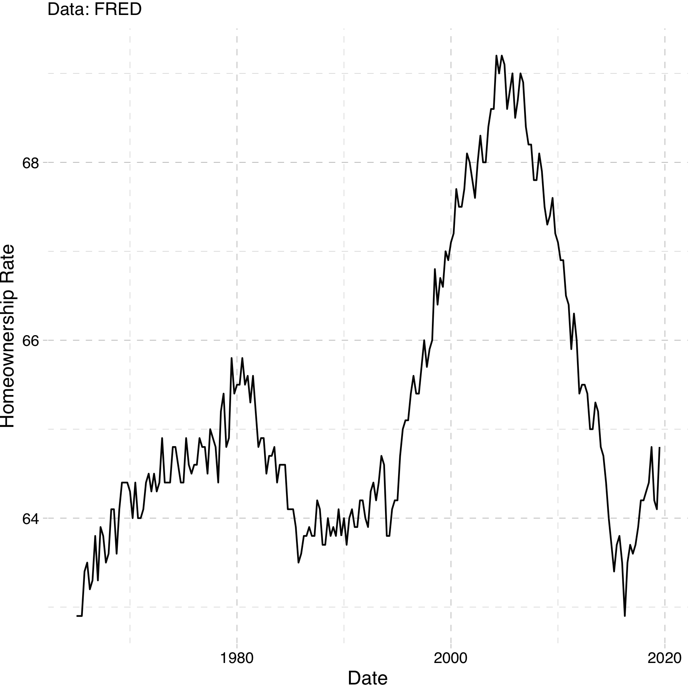
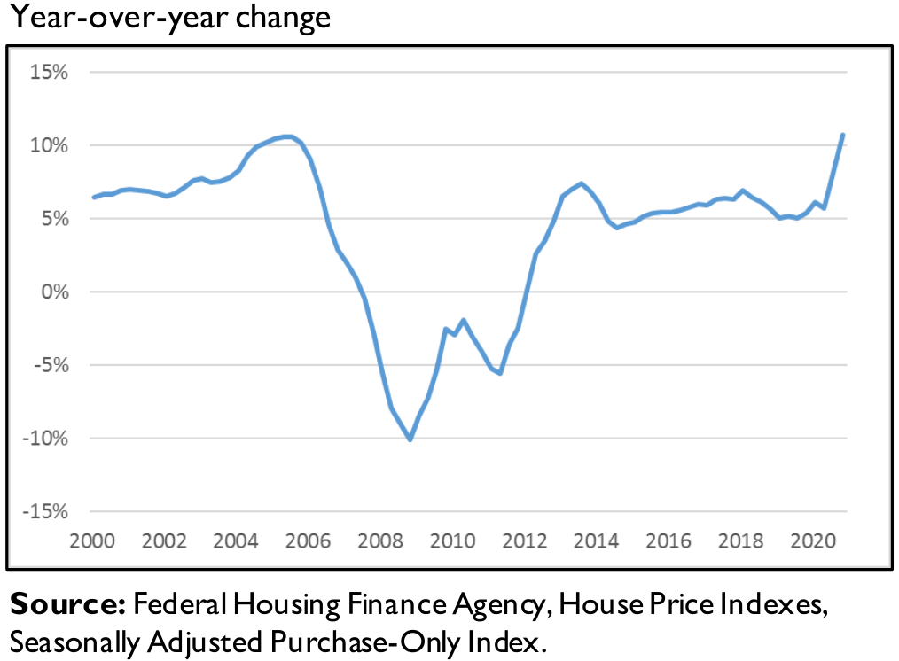
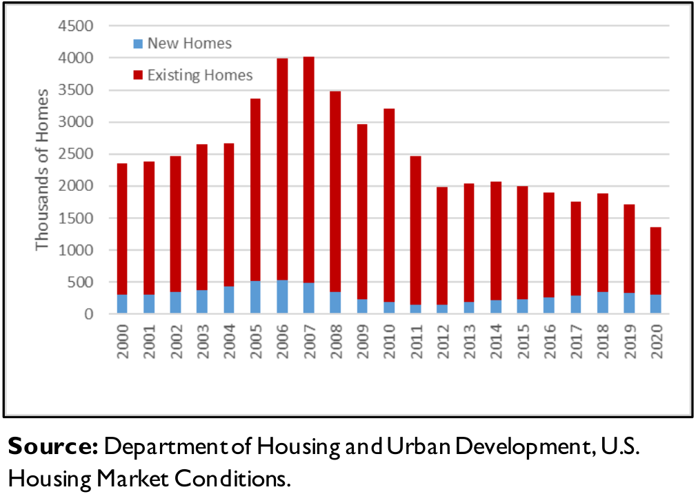
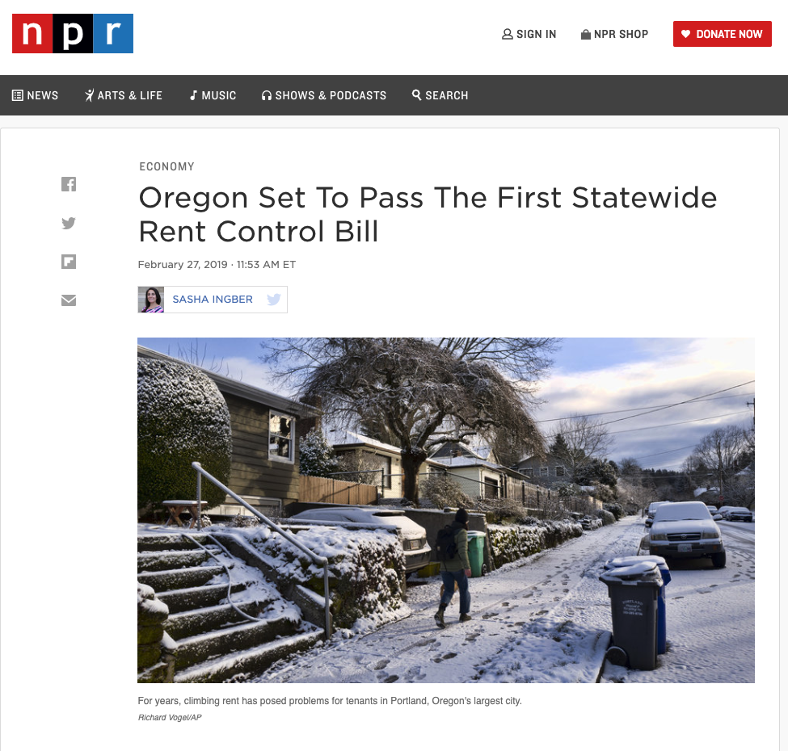

```{R, setup, include = F}
options(htmltools.dir.version = FALSE)
pacman::p_load(
  broom, here, tidyverse, latex2exp, ggplot2, viridis, extrafont,
  gridExtra, kableExtra, dplyr, magrittr, knitr, emo, ggrepel, sf, hrbrthemes
)

# Define colors
## source color script from local directory
## comment out and replace colors if user is not Andrew
source("~/Documents/scripts/colors/colors.R")
blue <- "#4c566a"
bblue = "#81a1c1"
purple <- "#b48ead"
red <- "#bf616a"
green = "#8fbcbb"
# XaringanExtra functions
## Tile view
xaringanExtra::use_tile_view()
## Scribble
xaringanExtra::use_scribble()
# Knitr options
opts_chunk$set(
  comment = "#>",
  fig.align = "center",
  fig.height = 7,
  fig.width = 10.5,
  warning = F,
  message = F
)
options(device = function(file, width, height) {
  svg(tempfile(), width = width, height = height)
})

theme_me = theme_ipsum(base_family = "Fira Sans Book", base_size = 20) + theme(panel.grid.minor.x = element_blank(),
      axis.title.x = element_text(size = 20),
      axis.title.y = element_text(size = 20))
```

class: inverse, middle
# Content

.hi-white[(i) Homeownership]

.hi-white[(ii) Rental markets]

---
# Housekeeping

.pull-left[
.hi[PS03] _(due Friday, Nov. 25)_
- Posted now (a couple of minutes ago)
]

.pull-right[
.hi[PS04] _(due Wed, Nov. 30)_
- will be posted by Mon next week
]

--

.hi[TotC book report] _(due Thu, Dec. 8)_
- Short (1000 words) assignment 
- rubric posted on canvas and on the course repo
- will be checking for plagiarism 

--

.hi-red[Final] _(14:45 Wed, Dec. 7)_
- [final schedule](https://registrar.uoregon.edu/calendars/examinations)
- Comprehensive exam with an emphasis on the newer material


---
class: inverse, middle
# Housing markets

---
# Housing markets 

Distinguish the following two markets:
- .hi[Rental Market:] Supply and Demand for rentals
- .hii[Housing Market:] Supply and Demand for houses

<br>

--

<br>

_Why is it important to distinguish these?_
 - A house is an asset. A month of rent is not
 - Homeowners are much less mobile than renters
  
  
---
# Homeownership

Following the great depression the .hi[New Deal] stimulated private homeownership by making it easier for individuals to buy and sell houses
- established the .hi[Federal Housing Administration] and the .hi[Home Owners Loan Corporation]

--

The Federal Government .hi[invented] the modern home mortgage by .hii[insuring] private home loans

Which .hi[incentivised] banks to accept:
- .hi-red[smaller] down payments
- .hi-red[lower] interest rates
- .hi-blue[longer] term loans (15/30 year mortgage) 

--

Allowed citizens to buy homes that they otherwise would not have afforded, establishing cycles of .hi[generational wealth]


---
# Homeownership

_Why is buying a home different than buying a pair of jeans?_

--

Houses are a major investment and store of value (.hi[equity])

--

Homeownership remains a .hi[key] component of household wealth
- The value is subject to some uncertainty
 
--

<br>
 
Purchasing a home is a .hi[dynamic] (forward-looking) decision

Jeans (a pure consumption good) is not really a store of value

--

We will focus on the rental  market.
--
 But first some data.

---
class: clear
# Rentals vs Homeowners

.center[

]

--

.smallerer[Why such a big spike?]

---
# Housing prices (nominal)

.center[

]

---
# Housing inventory

.center[

]

---
# Housing crisis (summarized)

.center[.hi[What caused the housing market crash in 2007?]]

--

.center[.hii[Among many other things, subprime mortgages]]

--

Historically, mortgage loans were a safe investment as defaulting was rare

--

Mortgages are typically bundled together with lots of other home loans and sold on a marketplace better banks

--

Due to growing home prices in the US housing market, these ".hi[securities]" were desirable and had higher returns than US treasury bonds and were in high demand. Lenders tried to keep up.

--

Mortgage lenders took too much risk by extending loans the millions of Americans who could not afford them

---
# Housing crisis (summarized)

These high risk, subprime loans were bundled into .hi[securities] with lower risk loans and sold them to banks

--

Rating agencies didn't fully understand the extent to which lenders were extending subprime loans and granted high grades (AAA)

--

Then the housing bubble popped, and high interest rates set in on adjustable loans, massive amounts of people defaulted

--

People shorted the banks on their investments and it lead to a massive financial crisis


---
class: inverse, middle 
# Rental markets

---
# Rental market model

Just like labor markets, each city has its own market for rental units 
- Consists of suppliers (absentee landlords) 
- Individuals making optimal housing demand decisions

--

.hi[Important:] Firms (landlords) supply housing to households

--

.hi[Assumptions:]

--

.hii[(i)] No individual landlord can influence the price of rents

--

.hii[(ii)] Landlords decide how much housing to provide

--

.hii[(iii)] The amount of housing they provide will again come from profit maximization


---
# Rental market model: Perf Comp

Profit function given by:

\begin{align*}
\pi(Q) = P*Q - TC(Q)
\end{align*}

--

.hi[Note:] Now cost is a function of quantity

--

Implicitly we are assuming that at any quantity, the firm will use the optimal level of labor and capital

--

Marginal profit equals zero , $\frac{\Delta \pi(Q)}{\Delta Q}= 0$:

--

\begin{align*}
 \frac{P*\Delta Q}{\Delta Q} - \frac{\Delta TC(Q)}{\Delta Q} = 0
\end{align*}

---
count: false
# Rental market model: Perf Comp

Profit function given by:

\begin{align*}
\pi(Q) = P*Q - TC(Q)
\end{align*}

.hi[Note:] Now cost is a function of quantity

Implicitly we are assuming that at any quantity, the firm will use the optimal level of labor and capital

Marginal profit equals zero , $\frac{\Delta \pi(Q)}{\Delta Q}= 0$:

\begin{align*}
 \frac{P*\Delta Q}{\Delta Q} - \frac{\Delta TC(Q)}{\Delta Q} &= 0\\
 P &= \frac{\Delta TC(Q)}{\Delta Q}
\end{align*}

---
count: false
# Rental market model: Perf Comp

Profit function given by:

\begin{align*}
\pi(Q) = P*Q - TC(Q)
\end{align*}

.hi[Note:] Now cost is a function of quantity

Implicitly we are assuming that at any quantity, the firm will use the optimal level of labor and capital

Marginal profit equals zero , $\frac{\Delta \pi(Q)}{\Delta Q}= 0$:

\begin{align*}
 \frac{P*\Delta Q}{\Delta Q} - \frac{\Delta TC(Q)}{\Delta Q} &= 0\\
 P &= \frac{\Delta TC(Q)}{\Delta Q}\\
 P &= MC(Q)
\end{align*}

---
count: false
# Rental market model: Perf Comp

Profit function given by:

\begin{align*}
\pi(Q) = P*Q - TC(Q)
\end{align*}

.hi[Note:] Now cost is a function of quantity

Implicitly we are assuming that at any quantity, the firm will use the optimal level of labor and capital

Marginal profit equals zero , $\frac{\Delta \pi(Q)}{\Delta Q}= 0$:

\begin{align*}
 \frac{P*\Delta Q}{\Delta Q} - \frac{\Delta TC(Q)}{\Delta Q} &= 0\\
 P &= \frac{\Delta TC(Q)}{\Delta Q}\\
 P &= MC(Q)
\end{align*}

.center[.hi[Increasing marginal costs leads to upward sloping supply curves!]]

---
class: inverse, middle

# Monopoly

---
# Rental market model: Monopoly

Now let's consider the .hi[monopoly] situation:

--

.hi[Assume:]

--

.hii[(i)] One seller of the good (rental units)

--

.hii[(ii)] The monopolist has market power; ability to set prices

--

.hii[(iii)] The monopolist is a profit maximizer

---
# Rental market model: Monopoly

Equilibrium relies on the assumption that firms maximize profits

--

Now TR is a function of quantity

\begin{equation*}
TR = P(Q)*Q
\end{equation*}

--

Quantity of houses that the monopolist produces changes the market price

--

$P(Q)$ in this context is called the inverse demand function
  
--

.hi[Profit is given by:]

\begin{align*}
\pi(Q) = P(Q)*Q - TC(Q)
\end{align*}
  


---
# Rental market model: Monopoly

Profit Maximization gives us the familiar $\frac{\Delta \pi(Q)}{\Delta Q} = 0$

--

\begin{align*}
\frac{\Delta P(Q)*Q}{\Delta Q} - \frac{\Delta TC(Q)}{\Delta Q} = 0 
\end{align*}
  
---
count: false
# Rental market model: Monopoly

Profit Maximization gives us the familiar $\frac{\Delta \pi(Q)}{\Delta Q} = 0$

\begin{align*}
\frac{\Delta P(Q)*Q}{\Delta Q} - \frac{\Delta TC(Q)}{\Delta Q} &= 0 \\
MR(Q) &= MC(Q)
\end{align*}

--

.hi[Note:] Now, $\frac{\Delta P(Q)*Q}{\Delta Q} \neq P$.

---
# Simple monopoly example

---
# Monopoly Graph

--

```{R, m1, echo=F,fig.height = 5, fig.width = 8, dev = "svg", cache=FALSE}
demandm <- function(x) 10 - 2*x
mr_m <- function(x) 10 - 4*x
supply <- function(x) 5+2*x

ggplot(data.frame(x=c(0, 3)), aes(x)) +
  stat_function(fun= demandm, col = purple)+
  stat_function(fun = mr_m, col = blue)+
  stat_function(fun = supply, col = bblue )+
  geom_vline(xintercept = 0)+
  geom_hline(yintercept = 0)+
  labs(x = "acres", y = "Price")+
  theme_me +
  annotate(x = 2.3, y = 2, label = "Marginal revenue", "text")+
  annotate(x = 2.3, y = 6, label = "Demand", "text")+
  annotate(x = 2.3, y = 9, label = "Supply (marginal cost)", "text")


```

---
count: false
# Monopoly Graph

```{R, m2, echo=F,fig.height = 5, fig.width = 8, dev = "svg", cache=FALSE}
ggplot(data.frame(x=c(0, 3)), aes(x)) +
  stat_function(fun= demandm, col = purple)+
  stat_function(fun = mr_m, col = blue)+
  stat_function(fun = supply, col = bblue )+
  geom_vline(xintercept = 0)+
  geom_hline(yintercept = 0)+
  labs(x = "acres", y = "Price")+
  theme_me +
  annotate(x = 2.3, y = 2, label = "Marginal Revenue", "text")+
  annotate(x = 2.3, y = 6, label = "Demand", "text")+
  annotate(x = 2.3, y = 9, label = "Supply (marginal cost)", "text")+
  geom_segment(aes(x = 5/6, xend = 5/6, y = 0, yend = supply(5/6)), linetype = "dashed")+
  geom_segment(
    aes(x = 5/6, xend = 5/6, y = 0, yend = demandm(5/6)),
    linetype = "dashed")+
  annotate(
    x = 5/6 , y = -.15, label = "Q_m", "text"
    )
```

---
count: false
# Monopoly Graph

```{R, m3, echo=F,fig.height = 5, fig.width = 8, dev = "svg", cache=FALSE}

ggplot(data.frame(x=c(0, 3)), aes(x)) +
  stat_function(fun= demandm, col = purple)+
  stat_function(fun = mr_m, col = blue)+
  stat_function(fun = supply, col = bblue)+
  geom_vline(xintercept = 0)+
  geom_hline(yintercept = 0)+
  labs(x = "acres", y = "Price")+
  theme_me +
  annotate(x = 2.3, y = 2, label = "Marginal Revenue", "text")+
  annotate(x = 2.3, y = 6, label = "Demand", "text")+
  annotate(x = 2.3, y = 9, label = "Supply (marginal cost)", "text")+
  geom_segment(aes(x = 5/6, xend = 5/6, y = 0, yend = supply(5/6)), linetype = "dashed")+
  geom_segment(aes(x = 5/6, xend = 5/6, y = 0, yend = demandm(5/6)), linetype = "dashed")+
  annotate(x = 5/6 , y = -.15, label = "Q_m", "text")+
  annotate(x =-.08 , y = demandm(5/6), label = "P_m", "text")+
  geom_segment(aes(x = 0, xend = 5/6, y = demandm(5/6), yend = demandm(5/6)), linetype = "dashed")


```

---
class: inverse, middle
# Rental markets across cities

---
# Rents across cities

.hi[Key question:] What causes rental curves to vary across cities?

--
  
Supply curves across cities are impacted by:
- .hi-blue[local construction costs]
- .hi-green[limited land availability] (for development)
- .hi-green[land-use regulations]

--

.hi-blue[Local construction costs]: shifts supply curve (labor is more expensive for all firms in one area vs another)

--

.hi-green[Land availability] + .hi-green[land use regulations:] rotates supply curve (changes in the marginal cost of developing land)

---
# Rents across cities

_Why do changes in local constructions costs shift the supply curve when land use regulations rotate it?_

--

.hi[Answer:] 

Changes in .hi-blue[construction costs] impact all development equally.
- if wood becomes more expensive then every project becomes equally more expensive across the city

Changes in .hi-green[land availability] or .hi-green[land-use regulations] increase the .hii[opportunity cost] of developing additional plots of land
- prices bid faster for each additional development


---
# Urban Housing Supply Curves

```{R, supply1, echo=F,fig.height = 5, fig.width = 8, dev = "svg", cache=FALSE}

housing_one <- function(x) 4 + 5*x
housing_two <- function(x) 1 + 5*x
housing_three <- function(x) 4 + 8*x


ggplot(data.frame(x=c(0, 10)), aes(x)) + 
  stat_function(fun= housing_one, col = blue, size = 1.5) +
  ylim(0,20)+
  xlim(0,5)+
  geom_vline(xintercept =0, size = 0.5) +
  geom_hline(yintercept =0, size = 0.5) +  
  labs(x = "Quantity of Housing", y = "Rents") +
  theme_me

```

---
count: false
# Urban Housing Supply Curves

```{R, supply2, echo=F,fig.height = 5, fig.width = 8, dev = "svg", cache=FALSE}

housing_one <- function(x) 4 + 5*x
housing_two <- function(x) 1 + 5*x
housing_three <- function(x) 4 + 8*x


ggplot(data.frame(x=c(0, 10)), aes(x)) + 
  stat_function(fun= housing_one, col = blue, size = 1.5) +
    stat_function(fun= housing_two, col = bblue, size = 1.5) +
  ylim(0,20)+
  xlim(0,5)+
  geom_vline(xintercept =0, size = 0.5) +
  geom_hline(yintercept =0, size = 0.5) +  
  labs(x = "Quantity of Housing", y = "Rents")+
  theme_me 

```

.hii[purple:] lower construction cost (lower intercept)


---
count: false
# Urban Housing Supply Curves

```{R, supply3, echo=F,fig.height = 5, fig.width = 8, dev = "svg", cache=FALSE}

housing_one <- function(x) 4 + 5*x
housing_two <- function(x) 1 + 5*x
housing_three <- function(x) 4 + 8*x

ggplot(data.frame(x=c(0, 10)), aes(x)) + 
  stat_function(
    fun= housing_one,
    col = blue,
    size = 1.5
    ) +
    stat_function(
      fun= housing_three, 
      col = green, size = 1.5
      ) +
  ylim(0,20)+
  xlim(0,5)+
  geom_vline(
    xintercept =0,
    size = 0.5
    ) +
  geom_hline(
    yintercept =0, 
    size = 0.5
    ) +  
  labs(
    x = "Quantity of Housing",
    y = "Rents"
    )+
  theme_me 

```


.hi-green[green:] higher .green[land-use regulations]

<!-- --- -->
<!-- class: inverse, middle -->
<!-- # Rental markets -->

<!-- .hi-white[We will focus on .hii[two] policies:] -->

<!-- .hi-white[(i) Rent Control] -->

<!-- .hi-white[(ii) Land-use restrictions] -->

---
class: inverse, middle
# Rent control

---
# Rent control

.hi[Definition:] .hii[Rent Control]

> A _price ceiling_ set on rental units

--

> _Price Ceiling:_ Max allowed price on the market

--

Brief History (US):

- Started around WW1. Expanded during WWII
  
--

- 1970: Nixon puts 90-day freeze on prices to combat inflation

--

- _Mostly_ a .hi[place based policy]. 
  - SF, NY, LA, Oakland, DC, Berkeley, West Hollywood
  - Oregon: first state to have  state-wide rent control

---
class: clear
# Rent Control 




---
# Rent Control in Oregon

### Senate Bill 608

2019: Oregon passes .hi[state-wide] rent control 
- limits annual increases to inflation (2-3%) + 7%
- landlords can increase rent without limit for new tenants

--

Also includes a series of eviction protections for renters 

---
class: inverse, middle
# Land use restrictions

---
# Land use restrictions

Land use restrictions limit what one can do with available land. 

--

Examples:

.hi[(i)] Density restrictions

.hi[(ii)] Minimum lot sizes

.hi[(iii)] Parking requirements

.hi[(iv)] Sidewalk and street size requirements

.hi[(v)] Height restrictions

--

Not all of these are bad things. But they do make developing land more expensive.

---
# Wharton Index


Higher values of the Wharton index $\implies$ tighter land use restrictions

---
# Example


---


# A Model

Do Land-Use regs and rent control interact? Absolutely! Let's model it

--

\begin{align*}
P(Q_d) &= 20 - 2*Q_d\\
P(Q_s) &= 8 + Q_s\\
\end{align*}

Compute the equilibrium. Graph it, if that is helpful

--

- Now suppose the government ratchets up land-use regs. New supply is given by:

\begin{align*}
P(Q_s^{new}) = 8 + 2*Q_s^{new}
\end{align*}

---
# Example

Old eq: $Q^* = 4$, $P^* = 12$

New eq: $Q^* = 3$, $P^* = 15$


Government comes in and says the rents are too high. Rent control set at $12$ per unit. Now you have:

\begin{align*}
12 = 8+2*Q_s \implies Q_s = 2
\end{align*}


---
count: false
# Example

Old eq: $Q^* = 4$, $P^* = 12$

New eq: $Q^* = 3$, $P^* = 15$


Government comes in and says the rents are too high. Rent control set at $12$ per unit. Now you have:

\begin{align*}
12 = 8+2*Q_s &\implies Q_s = 2\\
12 = 20 - 2*Q_d &\implies Q_d = 4
\end{align*}

---
count: false
# Example

Old eq: $Q^* = 4$, $P^* = 12$

New eq: $Q^* = 3$, $P^* = 15$


Government comes in and says the rents are too high. Rent control set at $12$ per unit. Now you have:

\begin{align*}
12 = 8+2*Q_s &\implies Q_s = 2\\
12 = 20 - 2*Q_d &\implies Q_d = 4
\end{align*}

So we have a .pink[shortage] of two units at the .hi.purple[old] equilibrium price. `r emo::ji("anguished")`

---
# A Note

We wont have time (but it might be good practice) for you to think through what would happen if the market was a .hi[monopoly]
- Similar to the .hi.purple[monopsonist], rent control can actually .pink[lower prices] in a completely .purple[monopolized] housing market


Let's take a (quick) look at some recent empirical evidence

---
# Empirics

[Diamond et. al (2019)](https://web.stanford.edu/~diamondr/DMQ.pdf)
- 1979: Rent control in SF put in place for all standing buildings with 5 apartments or more
- New buildings exempt (to promote developers to continue building)
- Small multi-family apartment buildings ("mom & pop") exempted
- 1994: Exemption for small multi-family buildings removed. All apartments .hi[built before 1980] subject to rent control
    
  
---
# Empirics

In this study:

- .hi[Treatment:] Those living in small apartment complexes (5 or less) built in 1979 or before

- .hi[Control:] Those living in small apartments complexes (5 or less) built after 1979 (not subject to rent control)

--

A fair comparison? Maybe concerned that those living in apartments built before or after 1979 are systematically different.

.hi.slate[Main Findings]: 

.hi[(i)] Reduced renter mobility by ~20%

.hi[(ii)] Reduced housing supply by about 15%


<!-- --- -->
<!-- exclude: true -->

<!-- ```{R, generate pdfs, include = F} -->
<!-- system("decktape remark 02_goodsmarket_part1.html 02_goodsmarket_part1.pdf --chrome-arg=--allow-file-access-from-files") -->
<!-- ``` -->


