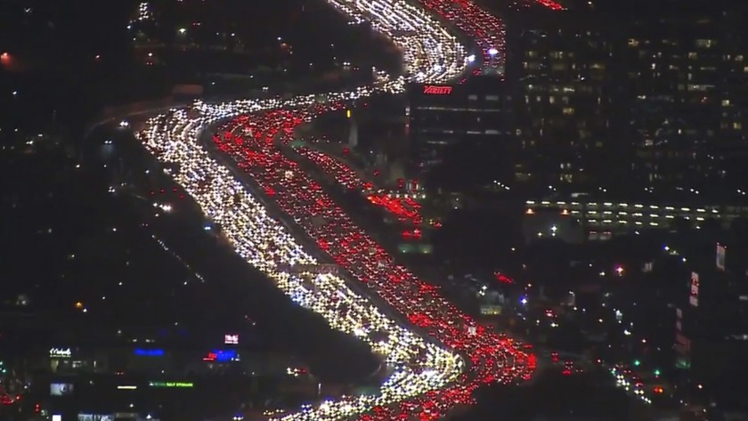

```{R, setup, include = F}
options(htmltools.dir.version = FALSE)
pacman::p_load(
  broom, here, tidyverse, latex2exp, ggplot2, viridis, extrafont,
  gridExtra, kableExtra, dplyr, magrittr, knitr, emo, ggrepel, sf, hrbrthemes
)

# Define colors
## source color script from local directory
## comment out and replace colors if user is not Andrew
source("~/Documents/scripts/colors/colors.R")
blue <- "#4c566a"
bblue = "#81a1c1"
purple <- "#b48ead"
red <- "#bf616a"
green = "#8fbcbb"
# XaringanExtra functions
## Tile view
xaringanExtra::use_tile_view()
## Scribble
xaringanExtra::use_scribble()
# Knitr options
opts_chunk$set(
  comment = "#>",
  fig.align = "center",
  fig.height = 7,
  fig.width = 10.5,
  warning = F,
  message = F
)
options(device = function(file, width, height) {
  svg(tempfile(), width = width, height = height)
})

theme_me = theme_ipsum(base_family = "Fira Sans Book", base_size = 20) + theme(panel.grid.minor.x = element_blank(),
      axis.title.x = element_text(size = 20),
      axis.title.y = element_text(size = 20))
```

class: inverse, middle
# Content

.hi-white[(i) Homeownership]

.hi-white[(ii) Rental markets]

---
# Housekeeping

.pull-left[
.hi[PS03] _(due Friday, Nov. 25)_
- Posted now (a couple of minutes ago)
]

.pull-right[
.hi[PS04] _(due Wed, Nov. 30)_
- will be posted by Mon next week
]

--

.hi[TotC book report] _(due Thu, Dec. 8)_
- Short (1000 words) assignment 
- rubric posted on canvas and on the course repo
- will be checking for plagiarism 

--

.hi-red[Final] _(14:45 Wed, Dec. 7)_
- [final schedule](https://registrar.uoregon.edu/calendars/examinations)
- Comprehensive exam with an emphasis on the newer material

---
class: inverse, middle
# Autos

---

# Auto use in the US


---

# Auto use in the US

.pull-left[

]

--

.pull-right[
.hi[Facts about American commuters:]
- 88 % use the car
- 5% use public transit
- 2 metro areas have public transit use > 10%
  - NYC
  - Chicago
]


---
class: clear

<iframe src="https://ourworldindata.org/grapher/road-vehicles-per-1000-inhabitants-vs-gdp-per-capita" loading="lazy" style="width: 100%; height: 600px; border: 0px none;"></iframe>

---
# Climate crisis

A recent [UN scientific report](https://www.ipcc.ch/report/ar6/wg1/#SPM) leaves no doubt that humans are responsible for the current climate crisis

--

Increased frequency of extreme weather including:

.pull-left[
- Wildfires
- Winter storms
- Hurricanes]
.pull-right[
- Heat waves
- Floods
- Droughts
]

--

Other consequences include:

.pull-left[
- Mass extinctions
- Changes in ocean currents]
.pull-right[
- Loss of habitat (reefs, rainforest, ice sheets)
- Sea level rise
]

---
class: clear


---
class: clear

<iframe src="https://ourworldindata.org/grapher/co-emissions-per-capita?tab=chart" loading="lazy" style="width: 100%; height: 600px; border: 0px none;"></iframe>

---
class: clear

<iframe src="https://ourworldindata.org/grapher/annual-co2-emissions-per-country" loading="lazy" style="width: 100%; height: 600px; border: 0px none;"></iframe>


---
# Policy questions

  
CO2 emissions in developing countries are .hi[skyrocketing]

--

<br>

_How do we .hi[reduce] CO2 per capita emissions?_

--

_What axiom is relevant here?_

--

_Do drivers fully .hii[internalize] the costs of CO2 emissions?_

---
class: inverse, middle
# Externalities

---

# Externalities

.hi[Recall Axiom 3:] .hii[Externalities cause inefficiency]

--

What are some externalities from driving?

--
.pull-left[
- Congestion
- Environmental Damage
- Collisions]
.pull-right[
- Blight (parking lots instead of parks)
- Noise Pollution]

--

.hi[How costly is congestion?]

Typical commuter spends .hi[47 hours per year] in traffic
- Very high in some metro areas (LA: 93, SF: 72, Atlanta: 67)
- Estimated gasoline cost due to congestion delays: .hi[5 billion per year]
- Time + Gas cost estimate: .hi[63 billion per year]


---
# Externalities

--

.smallerer[
.hi[Definition: Marginal Social Cost] (MSC)
> Added cost to _society_ from one extra unit of production/consumption

.hi[Note:] $MSC \neq  MC$
]

--

.smallerer[.hi[Definition: Marginal Private Cost] (MPC)

> Added cost to _agent_ from one extra unit of production/consumption

.hi[MSC] is the marginal cost (private) _plus_ the marginal _external_ cost]

--

.smallerer[
.hi[Definition: Marginal Social Benefit] (MSB)

> Added benefit to _society_ from one extra unit of production

]

--

.smallerer[
.hi[Definition: Marginal Private Benefit] (MPB)


> Added benefit to _society_ from one extra unit of production

]

---
# Congestion Externalities

MEC from congestion = $m\cdot v\cdot c$ where
- $m$ is the additional time in traffic from an extra vehicle on the road
- $v$ is the number of other road users
- $c$ is the opportunity cost of time

--

.hi[Note:] When there are few cares on the road, $m$ and $v$ are relatively small
- As the number of cars increases, MEC increases (it is nonlinear)
- Also: the above formula makes a strong assumption, what is it?


---
class: inverse, middle
# Congestion pricing

---
# Congestion

_How do we fix .hi[Congestion]?_

--

_What is the popular answer?_
--
 .hi[Build more roads]

--
  
If you build more
- more space for cars allowing congestion will decrease

--

_What assumption must we make when stating:_

.center[_"building roads will reduce congestion"_]

--

.hi[A:] The number of drivers will remain the same after the road is built

---
class: clear



---
# Congestion

Think of the .hi[incentives] of drivers

--

.hi[(i)] People avoid driving because it is costly
- time, gas, maintenance costs

--

.hi[(ii)] Building a new road makes it less costly
- time costs reduce

--

.hi[(iii)] On the .hi[margin], people will start to drive when the new road is built

--

.hi[Fundamental law of highway congestion:] 

> When you expand highways, more drivers will substitute toward the new lane

---
# Externalities

Generally when facing .hi-red[negative externalities], there exist .hi[two avenues] to reduce private consumption

.hii[(i)] Quotas

> Set minimum or maximum level of activity allowed

--

.hi[Examples:]

.pull-left[
- Fishing/hunting quotas/permits
- Cap and trade policies
]

.pull-right[
- minimum rest for truck drivers
- minimum age for driver's license + alcohol consumption
]

---
count: false
# Externalities

Generally when facing .hi-red[negative externalities], there exist .hi[two avenues] to reduce private consumption

.hii[(ii)] Taxes

> Increase the cost of consumption

Sometimes referred to as .hi[sin taxes]

--

.hi[Examples:]
.pull-left[
- tobacco taxes
- alcohol taxes
]
.pull-right[
- luxury taxes
]

---
# Congestion

If building more roads is not a great solution...

--

and self-driving cars are not viable...

--

.hi[Pigouvian taxes] are an excellent alternative

--

.hi[Main insight:] 

The social cost of driving exceeds private cost

So how can we raise the MPC such that $MPC = MSC$

--

_How can we do this?_
--
 .hi[Tax them.]

--

- Pigouvian tax specific to reducing road congestion is .hi[congestion pricing]
  
---
# Externalities: Pigouvian taxes

Many cities across the globe have enacted or are planning to enact congestion pricing

.pull-left[
- London
- Singapore
- Milan]
.pull-right[
- Stockholm
- Bejing
- NYC, LA, SF (coming soon)
]

--

.hi[Results:]

Following enactment of congestion pricing in London:

- Traffic was reduced by 15%
- Reduced travel times in the city by 30%

---
class: clear

.center[

]

London, UK

---
# Congestion pricing: London

.center[

]

---
# Congestion pricing: London

.center[

]


---

# Peak vs. Off Period Taxes


---
# Mechanisms

Model demonstrated congestion taxes reduce traffic volume. How?

--

.hi[(i)] Modal substition: switch to carpool, public transit

--

.hi[(ii)] Switch to off-peak travel

--

.hi[(ii)] Switch route

--

.hi[(iv)] Location decisions: change residence or workplace


---
# Discussion

Congestion taxes sound like a good idea, right? What are the problems?

--

- Roads aren't always congested. So tax needs to be time-varying. Gets very complicated

- Are all autos charged the same amount (semis and prius?)

--


