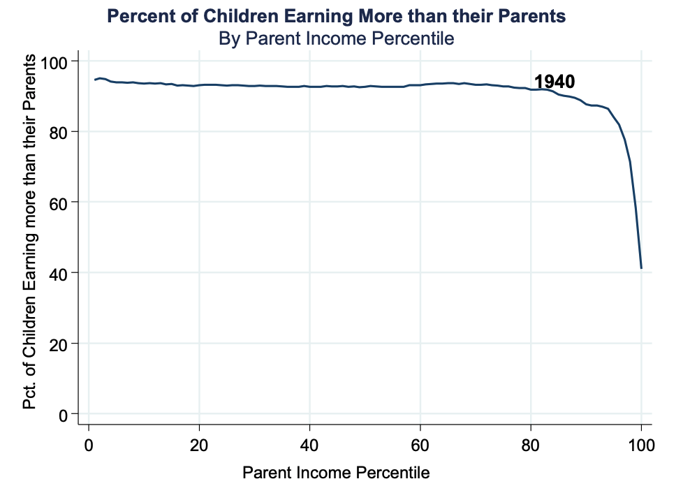
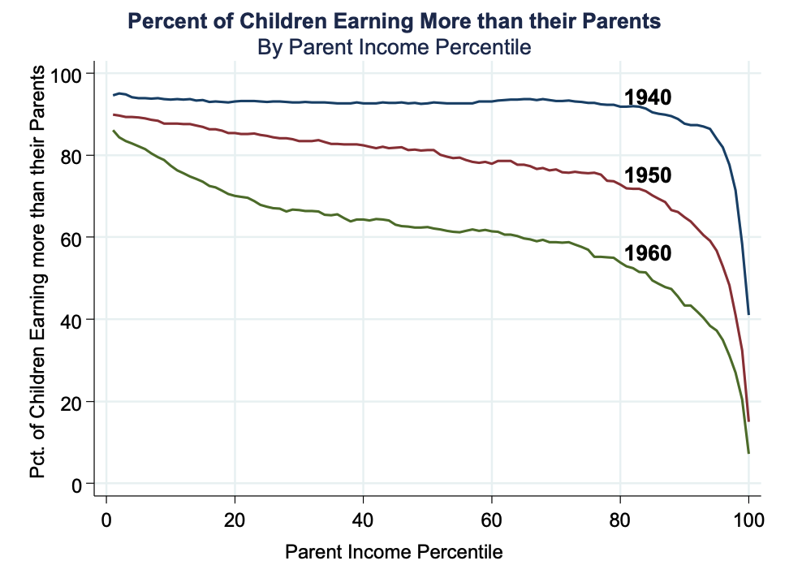

```{R, setup, include = F}
options(htmltools.dir.version = FALSE)
pacman::p_load(
  broom, here, tidyverse, latex2exp, ggplot2, viridis, extrafont,
  gridExtra, kableExtra, dplyr, magrittr, knitr, emo, ggrepel, sf, hrbrthemes
)

# Define colors
## source color script from local directory
## comment out and replace colors if user is not Andrew
source("~/Documents/scripts/colors/colors.R")
blue <- "#4c566a"
bblue = "#81a1c1"
purple <- "#b48ead"
red <- "#bf616a"
green = "#8fbcbb"
# XaringanExtra functions
## Tile view
xaringanExtra::use_tile_view()
## Scribble
xaringanExtra::use_scribble()
# Knitr options
opts_chunk$set(
  comment = "#>",
  fig.align = "center",
  fig.height = 7,
  fig.width = 10.5,
  warning = F,
  message = F
)
options(device = function(file, width, height) {
  svg(tempfile(), width = width, height = height)
})

theme_me = theme_ipsum(base_family = "Fira Sans Book", base_size = 20) + theme(panel.grid.minor.x = element_blank(),
      axis.title.x = element_text(size = 20),
      axis.title.y = element_text(size = 20))
```

class: inverse, middle
# Content

.hi-white[(i) The rise of "big data"]

.hi-white[(ii) "Big data" and the American Dream]

.hi-white[(iii) Causal Effect of Neighborhoods]

---
# Housekeeping

.pull-left[
.hi[PS03] _(due Friday, Nov. 25)_
- Posted now
]

.pull-right[
.hi[PS04] _(due Sun, Dec. 4)_
]

--

.hi[TotC book report] _(due Thu, Dec. 8)_
- Short (1000 words) assignment 
- rubric posted on canvas and on the course repo
- will be checking for plagiarism 

--

.hi-red[Final] _(14:45 Wed, Dec. 7)_
- [final schedule](https://registrar.uoregon.edu/calendars/examinations)
- Comprehensive exam with an emphasis on the newer material

---
class: inverse, middle
# The rise of "big data"

---
# Theoretical social science

Until very recently, social scientist were very limited by data to study these types of .hi[policy questions]

Social science has been mostly a .hii[theoretical field] to make policy recommendations

--

- Develop mathematical models (economics)
- Qualitative theories (sociology)

--

.hi[Problem:] We were never able to test most of these theories
- Led to politicization of scientific questions such as

> Is Obamacare reducing job growth in America?


---
# Big data and empirics

Social sciences are more empirical thanks to growing availability of data
- Test and improve theories using real world data


--

.center[

]

---
# Big data and empirics

.pull-left[
What is .hi[_"Big data"_]?

> Large datasets

]

--

.pull-right[
Where did .hi[_"Big data"_] come from?

Product of the .hii[internet age]
- Information costs $\rightarrow 0$
]

--

Product of post-internet private sector: ["Data is the new oil"](https://www.economist.com/leaders/2017/05/06/the-worlds-most-valuable-resource-is-no-longer-oil-but-data)<sup>.smallest[.hii[†]]</sup>

.footnote[.hii[†] Whatsapp, Robinhood]

.center[

]

---
# Big data and empirics

.hii[Examples:]

--

.pull-left[
- Government data: Tax records
- Corporate data: Google etc.
- Text data: Twitter, newspapers
]
.pull-right[
- Satellite imagery
- Cellphone location data
- GitHub data
]

--

.hi[Benefits:]
.pull-left[
- More reliable than surveys
- New variables (eg emotions, locations)]
.pull-right[
- Rich coverage $\Rightarrow$ study subgroups
- Large samples]

---
class: inverse, middle
# The American Dream <sup>.smallest[.hii[†]]</sup>

.footnote[.hii[†] This lecture uses content from Raj Chetty's course: https://opportunityinsights.org/course/
]


---
# The American Dream

 The .hi[American Dream] is an multi-faceted, abstract concept that may be interpreted in many ways
 
--

_Is the American Dream alive and well today?_
--
 _How should we .hii[judge] that?_

--

How can we distill the concept of an the American Dream into a .hi[statistic] that we can .hii[systematically measure] using big data?

 
--

Obama (2014): 
    
> People's frustrations are partly rooted "in the fear that their kids won't be better off than they were."

--

One .hii[systematic measure] the American Dream: _What fraction of children earn more income than their parents?_
--
 _Is this a .hi[fair] measure?_

--

We'd like to know: _How has this statistic changed over time?_
--
 _Up or down?_
 
---
class: clear

.center[

]

---
class: clear

.center[

]

---
class: clear
count: false

.center[

]


---
class: clear
count: false

.center[

]


---
class: clear
count: false

.center[

]

---
class: clear
count: false

.center[

]

---
class: clear

.center[

]

---
class: clear
count: false

.center[

]

---
# The fading American Dream

.center[.hi[What do these figures indicate about the American Dream?]]

--

.center[.hii[It has become harder and harder to reach it]]


--

<br>

.hi[Two] major changes in the American economy since the 1940s:

.hii[(i)] Lower total economic growth

.hii[(ii)] Less equal distribution of growth

---
# Growth in family income

The following chart compares growth in real mean family income by quintile between 1947-1973 and 1973-2013

.center[

]

---
# Growth in family income


---
# Growth in family income

.center[

]

---
# Growth in family income

.hi[Two] major changes in the American economy since the 1940s:
- Lower total economic growth
- Less equal distribution of growth

--

.hi[What policies can increase absolute mobility?]

--

Consider two hypothetical scenarios for children born in 1980:

.hii[(i)] .hi[Higher growth]

> 1940 cohort growth rate with the 1980 cohort historical distribution

.hii[(ii)] .hi[More broadly shared growth]

> Same 1980 cohort historical growth rates but 1940 cohort distribution across income groups

---
class: inverse, middle
## Which over these scenarios would have lead to a stronger American Dream?

---
# Hypothetical scenarios

.center[

]

---
# Hypothetical scenarios

.center[

]

---
# Hypothetical scenarios

.center[

]

---
# Restoring the American Dream

.hi[Main lesson:] Restoring the American Dream of high rates of upward mobility will require .hii[more broadly shared] economic growth

- Need policies that will increase incomes throughout the distribution

--

.hi[Two approaches of redistribution]

.hii[(i)] .hi[Redistribution]

  - Piketty and Saez: Reduction in top income taxes and erosion of unions and min wage have led working-class Americans to fall behind

--

.hii[(ii)] .hi[Human Capital Investment]

  - Goldin and Katz: race between education and technology – need education to keep pace with technological change to increase wage rates
  
---
class: inverse, middle
# "Big data" and the American Dream

---
# Measuring the American Dream

.hi[Central policy question:]
.center[_Why are children's chances of climbing the income ladder .hi-red[falling] in America?_]

--

.center[_What can we do to .hi[reverse] this trend?_]

--

Difficult to answer using .hi[historical data] and .hii[macroeconomic trends]

--

.hi[Problem:] We have too few data points to test all alternative explanations

--

- We never had the data to link parental income across generations

---
# Measuring the American Dream

The .hi[ideal data] to answer this question:

--

.hi[Individual] by .hii[year] observations across the American public including:
- family identifiers to link across generation
- residence information

--

The universe of .hi[tax records] fits the bill- linking generational income
- Chetty et al. (2017)
- Tracking earnings over someone's life at the .hi[individual level]

--
 
Allow researchers to observe .hi[generational differences] in income

---
class: clear

.center[

]

[Opportunity Atlas](https://www.opportunityatlas.org/)

---
class: clear

.center[

]

[Opportunity Atlas](https://www.opportunityatlas.org/)

---
class: inverse, middle
# Causal Effect of Neighborhoods


<!-- --- -->
<!-- # Neighborhood effects -->

<!-- .hi[Q:] How do we know that it truly is neighborhood effects (e.g who you grow up near) not driving this, and .hi[not] just ability sorting? -->

<!-- -- -->

<!--   - Chetty et al. isolate the causal impacts of neighborhoods by analyzing the propensity to patent by a narrow technology class -->

<!-- <br> -->

<!-- .hi[Intuition:] Genetic ability (sorting of high skilled labor) is unlikely to vary significantly across similar technology classes.  -->


---
# Causal Effect of Neighborhoods

The propensity for an individual to reach the American Dream seems to depend greatly on the location they were raised

--

Understanding why this .hi[heterogeneity] exists may be key to understanding how to improve .hii[social mobility]

--

_But is this relationship .hi[causal]?_

_How should we think about the explanations of these results?_

--

There are two different explanations: 

--

.hii[(i)] .hi[Sorting:] Similar people live near each other (educated people live near other educated people)

--

.hii[(ii)] .hi[Causal impacts:] places have a .hi[causal effect] on updward mobility

---
# Causal Effect of Neighborhoods

What is the .hi[ideal experiment]?

--

.hii[Randomly assign] children to neighborhoods. Compare adult outcome
- Can't do this? So what can we do?
  
--

.hi[Chetty & Hendren (2018)]

.hi[Quasi-experiment:] Observe data on 7 million families that move 
 
.hi[Key Idea:] Exploit variation in _age of child_ when family moves to identify causal impact of neighborhood environment
  
---
class: clear

.center[

]

---
count: false
class: clear

.center[

]

---
count: false
class: clear

.center[

]

---
count: false
class: clear

.center[

]

---
# Assumptions

To identify causal impact of neighborhoods, you need to believe that .hi[the timing of moves to better/worse areas are unrelated to other determinants of child's outcomes].

--

This assumption might not hold for two reasons:

--

.hi[(i)] Parents who move to good areas when their children are young might be different than those who move later

--

.hi[(ii)] Moving may be unrelated to other factors (e.g change in parents' job) that impact children directly

--

.hi[Both of these concerns are addressed]

--

- Compare across siblings

---
class: inverse, middle
# Geography of Upward Mobility


---


# A Familiar Map


---

# Last Q

OK, so: .hi[neighborhoods matter for upward mobility]. Next question: _why does this vary across cities/places?_

- To answer this question, it would be good to start by comparing places with high upward mobility to low upward mobility
  
  - Do places with higher mobility have better schools, jobs, institutions, something else? All?
  

---

# Correlations


---
# Correlations

5 strongest correlates of upward mobility are:

.hii[(i)] .hi[Segregation:] Greater racial and income segregation associated with lower levels of mobility

---
count: fasle
# Segregation

.center[

]

---
count: fasle
# Segregation

.center[

]

---
count: false
# Correlations

5 strongest correlates of upward mobility are:

.hii[(i)] .hi[Segregation:] Greater racial and income segregation associated with lower levels of mobility

.hii[(ii)] .hi[Income Inequality:] Places with a smaller middle class have less mobility

--

.hii[(iii)] .hi[School Quality:] Higher expenditure, smaller classes, higher test scores $\implies$ more mobility
  
--

.hii[(iv)] .hi[Family Structure:] Areas with more single parents have much lower mobility
  - Strong correlation even for kids whose _own_ parents are married
  
--
  
.hii[(v)] .hi[Social Capital:] "Takes a village to raise a child"

---
# Policies to improve upward mobility

In general, there are two policy approaches to increasing upward mobility

--

.hii[(i)] .hi[Moving to Opportunity] (MTO): Provides affordable housing in high-opportunity areas

--

.hii[(ii)] .hi[Place-Based Investments:] Increases upward mobility in low-opportunity areas

--

.qa[Q]: Can you think of the pros and cons of each approach?

---
# MTO

.hi[MTO Experiment:]

Implemented from 1994-1998 in 5 locations: Baltimore, Boston, Chicago, LA, NY
- 4,600 families randomly assigned to one of three groups:

--

.hii[(i)] .hi[Experimental:] Offered housing vouchers restricted to low-poverty census tracts
  
--

.hii[(ii)] .hi[Section 8:] Offered conventional housing vouchers, no restrictions
  
--

.hii[(iii)] .hi[Control:] not offered a voucher, stayed in public housing

---

# Results

.center[

]

---
# Implications

Housing vouchers can be effective -- but should be target carefully

- Vouchers should be explicitly designed to help families move to affordable, high-opportunity areas

--

  - In MTO experiment, unrestricted vouchers produced .hi[smaller] gains even though families could have made same moves
 
--

  - More generally, low-income families rarely use cash transfers to move to better neighborhoods

--

  - 80% of 2.1 Section 8 vouchers are currently used in high-poverty, low-opportunity neighborhoods

---


# MTO Issues

What are the concerns with experiments like MTO?

--

.hii[(i)] .hi[Costs]: how costly would it be to scale this up?

--

.hii[(ii)] .hi[Negative spillovers]: does integration hurt the wealthy (which would dampen the effect of the spillovers)?

--

.hii[(iii)] .hi[Limits to scaling due to sorting]. If you move all low-income people into a high-income neighborhood, it is no longer a high-income neighborhood. 

---

# Place-Based Approaches

A .hi[place-based approach] would be something like:

.hii[(i)] Investment in schools in high-poverty areas

--

.hii[(ii)] Investment in infrastructure in high-poverty areas

--

.qa[Q]: What is the main problem with place-based approaches?

--

  - Displacement! Locational eq $\implies$ more people sort into a neighborhood if it has higher school quality
  
--

  - This drives up prices and the residents that it intended to help were ultimately harmed

---
class: inverse, middle
# Review

---

# This course: In Review

We have finished all of the material in the class!

__Thank you__ for your time and energy. A quick recap:


  
---

count: false
# This course: In Review

We have finished all of the material in the class!

__Thank you__ for your time and energy. A quick recap:

1) Big, philosophical questions
  
  - What is a city? Why do they exist?
  
  - What makes some cities grow and others shrink?

2) Tools!

  - Locational equilibrium (x2)
  
  - Bid-rent curves
  
  - Two labor market models
  
---
# This course: In Review

3) Applications:

  - Min wage & rent control
  
  - Land use & housing policy
  
--

My .hi[big picture] takeaways:

  - Location matters! The geographic level at which we implement policy matters, too
  
  - Differences in structure of labor/housing market can lead to vastly different outcomes from the same policy
  
  - Public policy questions are often more nuanced than they appear on a surface level 
  
---
class: inverse, middle
# Thank you for a great class :)


